# C64 with 9V AC at 50 or 60 Hz

I got a retrofit power supply for my C64 with a switch for 50 or 60 Hz.
I needed to study this to understand what it means.
This howto documents that.

## Introduction

I met the guy behind SPL ([SideProjectsLab](https://github.com/sideprojectslab))
at a Commodore fair in the Netherlands. He is working on a not yet released 
(April 2026) USB power supply for the C64. I bought a pre-release model from him. 
I'm guessing he might be calling it the USB-C64.

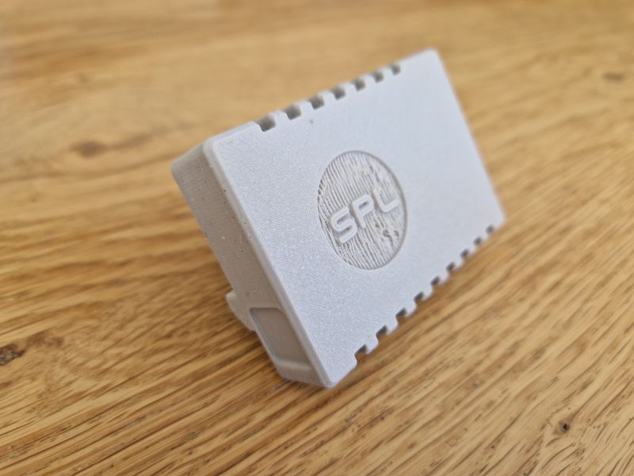 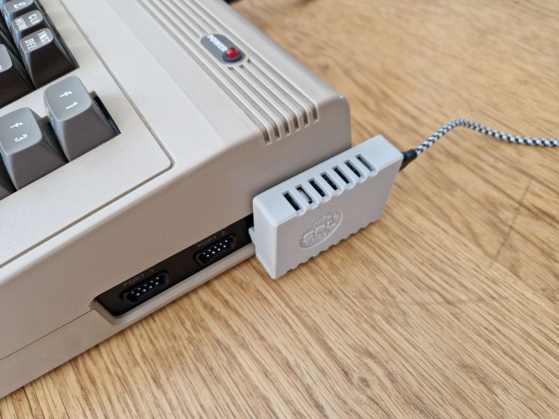

The USB-C64 device is a small "block" that you plug into the DIN power connector 
of the C64. The USB-C64 itself is powered by USB PD. The circuitry in the USB-C64 
negotiates 12V from a USB PD power adapter, and converts it to 5V DC and 9V DC.  
It has a power LEDs and two switches. The upper switch is the on/off switch, 
the lower switch is an 50Hz/60Hz selector. 

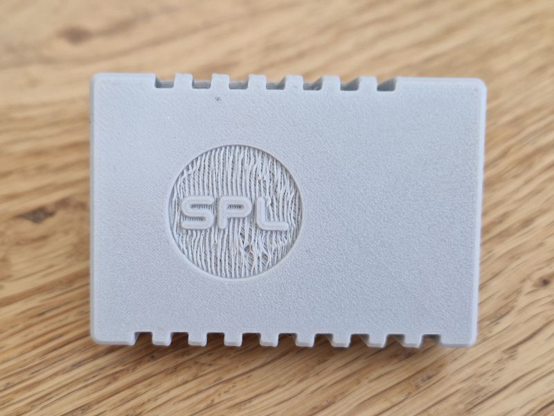 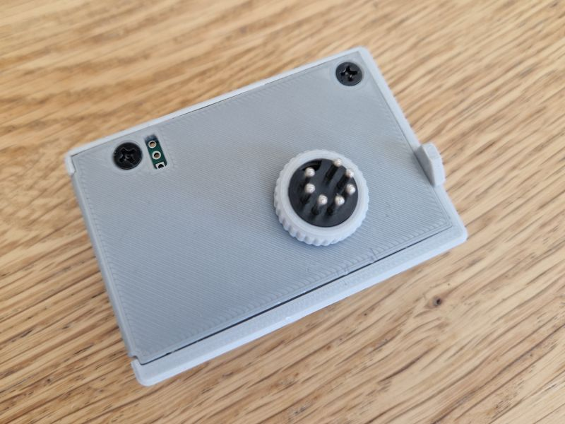
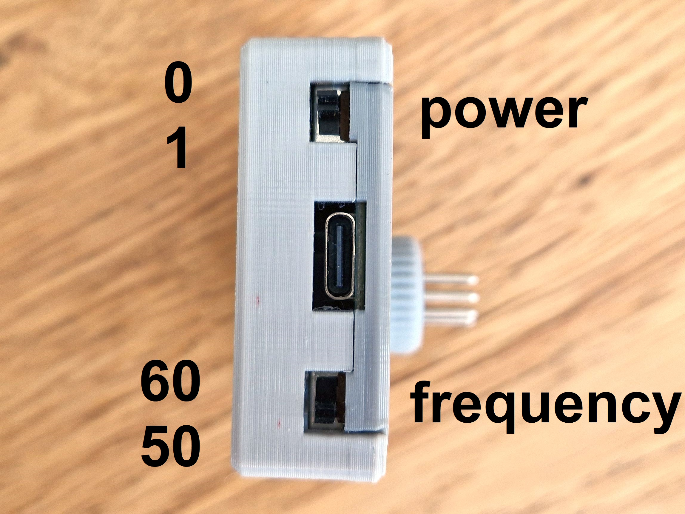 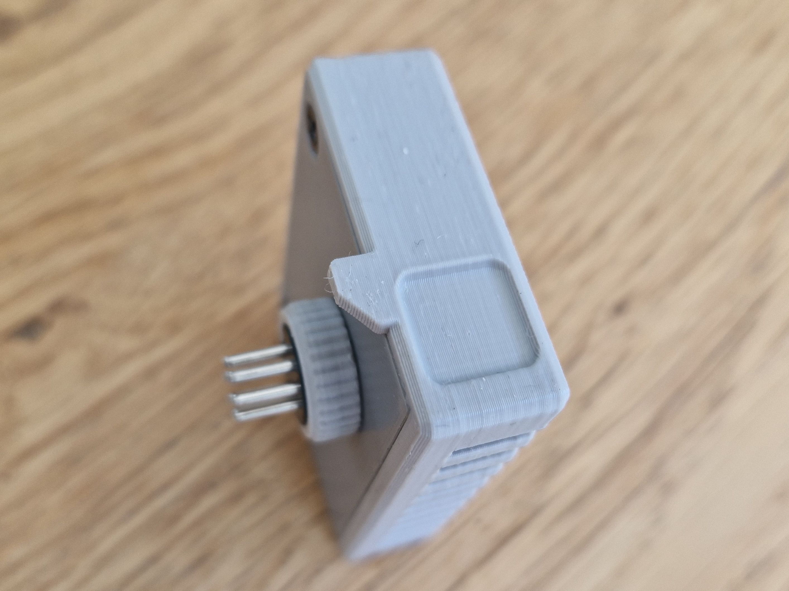

I flipped the 50/60 selector and nothing seemed to happen. 
This howto is the result of my trying to understand what this frequency switch is about.

## 50Hz/60Hz switch

Since the USB-64 was not yet released, there was no dicumentation.
The lower switch being a 50/60Hz selector was just what I remembered 
from the creator's presentation.

My multimeter has a frequency mode, and I measured the frequency over 
pin 6 and 7, and indeed when the switch is in the down position 
I measure 49.97 and when it is in the up position I measure 59.96Hz.
So my memory was correct, the lower switch selects 50 and 60 Hz.
What is it used for? 

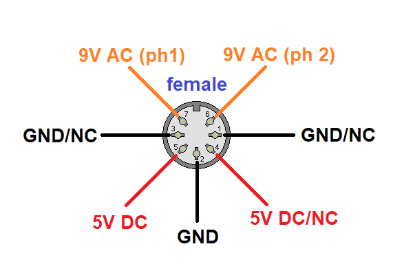

By the way, the frequency switch is not momentarily active.
It seems only to be sampled by the USB-64 when it is switched on.

## 50Hz/60Hz is that PAL/NTSC?

My first gut reaction was that this 50Hz/60Hz selector has to do with PAL and NTSC.
However, a country like Brazil used PAL encoding combined with a 60Hz refresh rate.
The opposite is more obscure, but it seems Myanmar used NTSC despite being in a 
50Hz region. 

I soon realized that the clock of the CPU is created by a crystal, not the mains
frequency. The crystal is Y1, we see it in the right of the top center in below
photo. The print on the component shows 17... which is the frequency for PAL 
(17.73447 MHz), NTSC would have 14.31818 MHz. Via U31 (chip in center),
a [Dual voltage-controlled oscillators](https://www.ti.com/product/SN74LS629), the
clock reaches the VIC-II (U19, big chip at the bottom of below image). 
The VIC-II in my machine is an 6569 the PAL variant; NTSC would have the 6567.

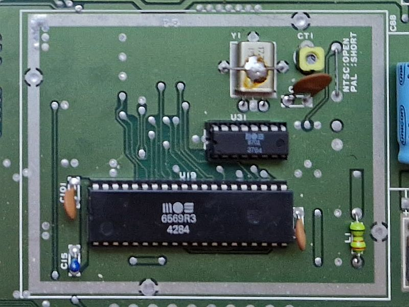

I definitly have a PAL machine.
As [c64 wiki](https://www.c64-wiki.com/wiki/Hardware_internals_of_the_C64) explains

> Y1 defines the _Color Clock_ (17.734472 MHz for PAL).

> The _Pixel Clock_ (PAL: ~7.88 MHz Dot Clock) is generated from the color clock 
> by the PLL in U32; each nine color clock edges there are four pixel clock edges
> (the ratio for NTSC is 7:4).

> Φ0 (~1 MHz) is an output signal from the VIC, where the pixel clock divided 
> by 8 is present. Φ0 clocks the 6510. 

## 50Hz/60Hz is for CIA

Clearly the 50/60 selector does not influence VIC-II video or 6510 CPU.
I have copy of the [Commodore 64 Programmer's Reference Guide](http://cini.classiccmp.org/pdf/Commodore/C64%20Programmer's%20Reference%20Guide.pdf) 
and that contains at the end of the book, an insert, with the schematics.

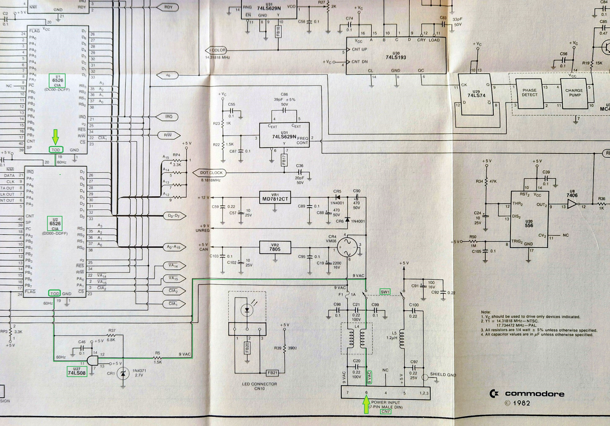

We see that the CIAs have their pin 19 for TOD (Time Of Day) connected to 
the 9V AC, through U27, a quad AND-gate 
[74LS08](https://www.ti.com/lit/ds/symlink/sn74ls08.pdf), likely to 
"digitize" the sine wave.

Inside the CIA (Complex Interface Adapter) chip, there is a Time of Day clock. 
This clock is designed to track "real-world" time; it is driven by the 
frequency of the 9V AC coming from the power supply. The TOD has four 
registers (08..0B in BCD): hour, minutes, seconds and tenth of seconds. 

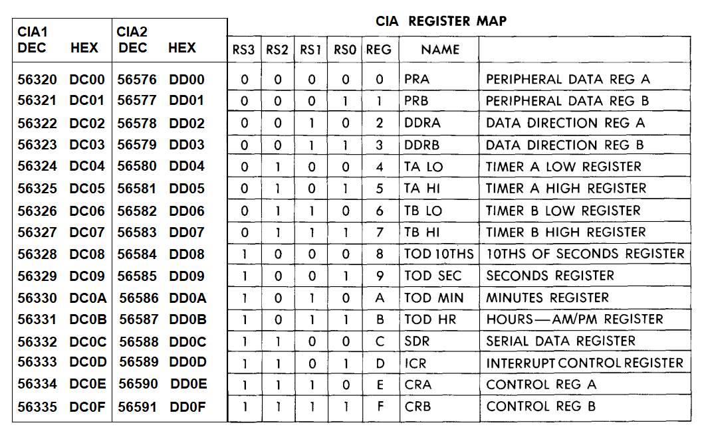

The CRA register of the CIA has TODIN as bit 7. It indicates if the 
"10THS of SECONDS" register is incremented every 5 or every 6 edges 
on the TOD pin. In other words, with the TODIN bit we can tell the CIA
whether the 9V AC contains a 50Hz or a 60 Hz signal. 

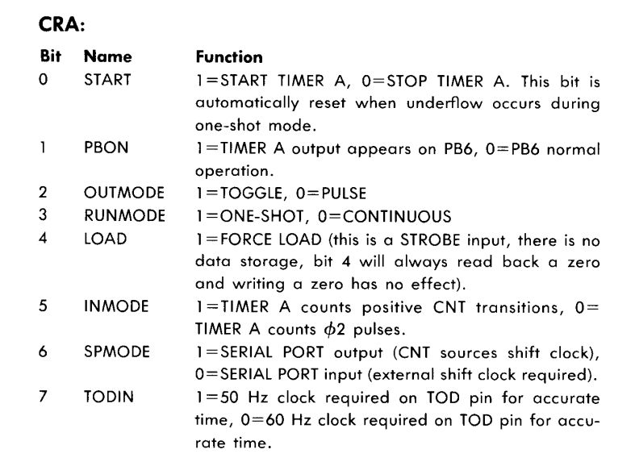

As far as I know, the TOD is the only usage of the AC signal 
(except maybe that it is also present on the user port).

If a retrofit power supply supplies 9V DC instead of AC, 
the CIA TOD wouldn't step. Gemini added

> The **9V AC** is also rectified internally by the C64 to create **12V DC**.
> This is required for the SID (Sound Interface Device) chip and the video circuitry. 
> A modern 9V DC supply works fine for this because the bridge rectifier 
> on the motherboard will happily pass DC through.

## The test - BASIC program

I want to test this on the real system.

The Kernal maintains a Jiffy clock. It counts 1/60 seconds, based on the
CPU clock, which is derived from the crystal, not the 9V AC frequency.
We can compare the Jiffy clock, with the TOD of the CIA.

To access the Jiffy clock in BASIC, we can simply use the variable `TI`.
To access the TOD, we need to `PEEK` and `POKE`, see the register addresses 
in the table from the previous paragraph.

(end)
