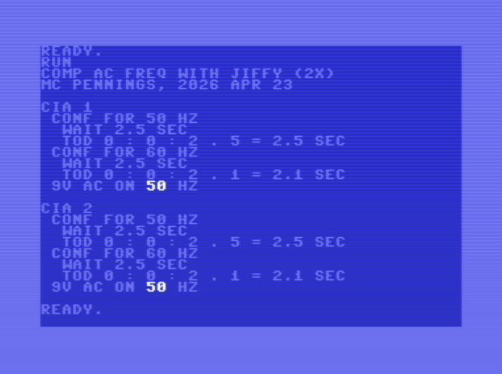
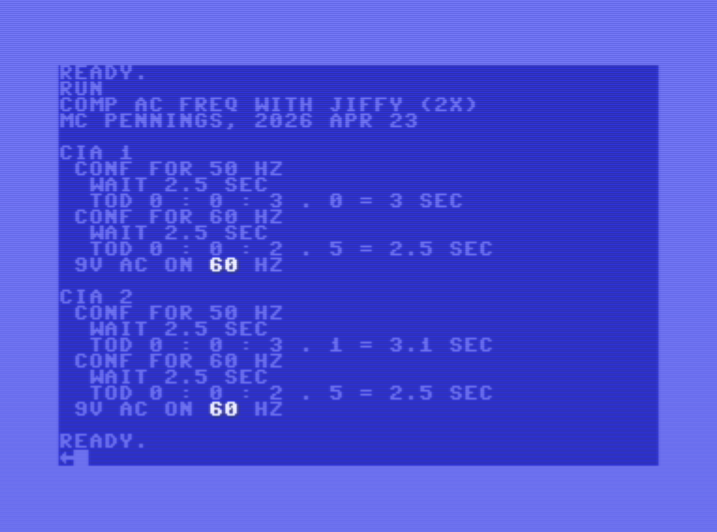
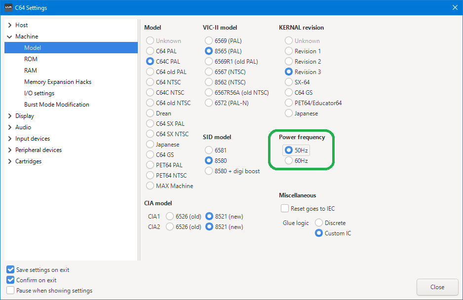

# C64 with 9V AC at 50 or 60 Hz

I got a retrofit power supply for my C64.
It has a switch which selects between 50 or 60 Hz.
I needed to study this to understand what it means.
This _howto_ documents that.

## Introduction

I met Vittorio Pascucci, the man behind _SPL_ 
([SideProjectsLab](https://github.com/sideprojectslab))
at a Commodore fair in the Netherlands. He made a USB power supply for the C64. 
It's called the PD-64. I bought a pre-release model from him (April 2026). 
By now (May 2026) he offically [released](https://github.com/sideprojectslab/PD-64) it.


 

The PD-64 device is a small "block" that you plug into the power socket
of the C64. The PD-64 itself must be powered by a USB power adapter compliant
with USB Power Delivery (PD). The circuitry in the PD-64 negotiates 12V from 
the USB power adapter, and converts it to 5V DC and 9V AC. That is already 
interesting: the PD-64 must generate AC from DC.

  

The PD-64 device has two LEDs and two switches.
I'm assuming the LEDs are for 5V ok and for 9V ok. 
The upper switch is the on/off switch, the lower switch is the 50Hz/60Hz selector.
At least that is what I remembered from Vittorio's presentation.

 

I flipped the 50/60 selector and nothing seemed to happen. 
This _howto_ is the result of me trying to understand what this frequency switch is about.


## 50Hz/60Hz switch

Since the PD-64 was not yet released, there was no documentation.
The lower switch being a 50/60Hz selector was just what I remembered 
from the creator's presentation. Can I confirm its function?

> By now there is [documentation](https://raw.githubusercontent.com/sideprojectslab/PD-64/main/doc/user_manual.pdf).

My multimeter has a frequency mode, and I measured the frequency over 
pin 6 and 7, and indeed when the switch is in the down position 
I measure 49.97 and when it is in the up position I measure 59.96Hz.
So my memory was correct, the lower switch selects 50 and 60 Hz.
What is it used for? 


By the way, the frequency switch is not momentarily active.
It seems to be sampled by the PD-64 at startup only
(when the PD-64 is powered on).


## 50Hz/60Hz is that PAL/NTSC?

My first gut reaction was that this 50Hz/60Hz selector has to do with PAL and NTSC.
However, a country like Brazil used PAL encoding combined with a 60Hz refresh rate.
The opposite is more obscure, but it seems Myanmar used NTSC despite being in a 
50Hz region. 

I soon realized that the clock of the CPU is created by a _crystal_, not by the mains
frequency. The crystal is Y1, we see it right of the top center in below
photo. The photo shows a part of the C64 breadbin motherboard (below the VIC-II can). 
The marking on the component Y1 shows 17 or even 17.7 which is the frequency for PAL 
(17.73447 MHz), NTSC would have 14.31818 MHz. Via U31 (chip in center),
a [Clock Generator](https://www.renesas.com/en/document/dst/ics8701-data-sheet), 
the clock reaches the VIC-II (U19, big chip at the bottom of below image). 
The VIC-II in my machine is a 6569, the PAL variant; NTSC would have the 6567.


The conclusion is that I definitly have a _PAL_ machine.

As [c64 wiki](https://www.c64-wiki.com/wiki/Hardware_internals_of_the_C64) explains

> Y1 defines the _Color Clock_ (17.734472 MHz for PAL).

> The _Pixel Clock_ (PAL: ~7.88 MHz Dot Clock) is generated from the color clock 
> by the PLL in U32; each nine color clock edges there are four pixel clock edges
> (the ratio for NTSC is 7:4).

> Φ0 (~1 MHz) is an output signal from the VIC, where the pixel clock divided 
> by 8 is present. 

Signal Φ0 clocks the 6510. 

Note [ASSY 250425](https://www.c64-wiki.com/wiki/Motherboard#ASSY_250425) 
replaced the clock generation circuit using a single IC (U31, 8701); before that there was 
the [Dual voltage-controlled oscillators](https://www.ti.com/product/SN74LS629).


## 50Hz/60Hz is for CIA

Clearly the 50/60 selector does not influence the VIC-II video or the 6510 CPU.
I have copy of the [Commodore 64 Programmer's Reference Guide](http://cini.classiccmp.org/pdf/Commodore/C64%20Programmer's%20Reference%20Guide.pdf),
which contains, at the end of the book, an insert with the schematics.
Below is a photo of part of the schematics, I made some tracks and pins _green_; those are related to 9V AC.


We see that the CIAs (chips U1 and U2 on the left) have their pin 19 for **TOD** 
(Time Of Day) connected to the 9V AC, through U27 (bottom left), a quad AND-gate 
[74LS08](https://www.ti.com/lit/ds/symlink/sn74ls08.pdf), likely to 
"digitize" the sine wave. The AND-gate is fed via power switch SW1 from 
power input CN7 (the C64 DIN socket for power).

Inside the CIA (Complex Interface Adapter) chip, there is a Time of Day clock. 
This clock is designed to track "real-world" time; it is driven by the 
frequency of the 9V AC coming from the power supply. The TOD has four 
registers (08..0B): hour, minutes, seconds and tenth of seconds (green in the table below). 


The CRA register of the CIA (also green in the table above) has, as bit 7,
a flag called TODIN (green box in image below). This flag indicates if the 
"10THS of SECONDS" register is incremented every 5 or every 6 edges on the 
TOD pin. In other words, with the TODIN bit we can tell the CIA whether the 
9V AC contains a 50Hz or a 60Hz signal. 


As far as I know, the TOD is the only usage of the AC signal 
(except that it is also present on the user port).

If a retrofit power supply supplies 9V DC instead of AC, 
the CIA TOD wouldn't step, but for the rest all is fine. 
Gemini adds

> The **9V AC** is also rectified internally by the C64 to create **12V DC**.
> This is required for the SID (Sound Interface Device) chip and the video circuitry. 
> A modern 9V DC supply works fine for this because the bridge rectifier 
> on the motherboard will happily pass DC through.

Apparently I was too trustful in Gemini because Vittorio 
commented on [discord](https://discord.gg/gJsCgebkDw):

> One little detail, when you mention that 9v output might as well be DC if one is not interested in the TOD clock, that is not entirely accurate. Only an AC voltage can operate the charge pump that provides the voltage for the on board 12v linear regulator for the SID, the VIC and the RF modulator. Plus it's important to keep in mind that 9vAC corresponds to 12.6v peak, and that's what matters when you plan on putting that voltage through a rectifier, as it will follow and hold the peak rather than the RMS value (minus the diode drop and the ripple)


## Writing a BASIC program to test

I want to test the TOD being driven by the 9V frequency.

The Kernal maintains a Jiffy clock. It counts 1/60 seconds, based on the
CPU clock, which is derived from the crystal, not from the 9V AC frequency.
We can compare the Jiffy clock, with the TOD of the CIA.

To access the Jiffy clock in BASIC, we can read variable `TI`.
To access the TOD, we need to `PEEK` and `POKE` the CIA, 
see the register addresses in the table from the previous paragraph.

Below is the BASIC program I wrote.
It is de-token-ized by `petcat`, which comes with 
[VICE](https://vice-emu.sourceforge.io/),
the Versatile Commodore Emulator. The original `PRG` source is also 
[available](9vac-freq-2x.prg).


```basic
100 print"comp ac freq with jiffy (2x)"
110 print"mc pennings, 2026 apr 23"
120 for c=1to2:print:print"cia"c:a=56320+256*(c-1):aa=a+14:gosub200:next:end
200 pokeaa,peek(aa)or 128:gosub300:r5=r
210 pokeaa,peek(aa)and127:gosub300:r6=r
220 on 1-r5-2*r6 goto 240,250,260
230 print " {wht}error{lblu}":return
240 print " 9v {wht}dc{lblu}, not ac":return
250 print " 9v ac on {wht}50{lblu} hz":return
260 print " 9v ac on {wht}60{lblu} hz":return
300 f=60+10*(peek(aa)>127)
310 print " conf for"f"hz"
320 poke a+11,0:poke a+10,0:rem h:m
330 poke a+ 9,0:poke a+ 8,0:rem s.t
340 ts=2.5:print"  wait";ts;"sec":t0=ti
360 if ti-t0<ts*60 then 360
370 h=peek(a+11):m=peek(a+10)
380 s=peek(a+ 9):t=peek(a+ 8)
390 x=int(s/16):x=10*x+(s-16*x)+t/10
400 print "  tod"h":"m":"s"."t"="x"sec"
410 r=abs(ts-x)<0.1:return
```

The above programs contains three parts: main, CIA and measurement.

- The **main routine** is lines 100-120. It starts two identical tests, 
  one with CIA1 and one with CIA2. The variable `c` contains the CIA number, 
  and `a` the address of its first register. Variable `aa` is just `a+14`, 
  it is introduced to make lines 200 and 210 fit on one screen line.

- The **CIA routine** is on lines 200-260.
  This routine configures the CIA for 50 Hz (setting the TODIN flag),
  then measures time (line 200). Next, it configures the CIA for 60 Hz,
  and again measures time (line 210). 
  
  Measuring time in this context means: resetting the CIA's TOD to 0,
  then using the Jiffy clock to wait 2.5 seconds, then reading the CIA's TOD,
  and finally returning true iff the TOD also reads 2.5 seconds.

  The results of the 50Hz and 60Hz tests are in `r5` and `r6`; 0 for false 
  and -1 for true. This leads to 4 cases: TOD equals Jiffy at 50 Hz, 
  TOD equals Jiffy at 60 Hz, and the border case TOD doesn't equal Jiffy
  in either test. The fourth case, TOD equals Jiffy in both tests is considered an error. Line 220 jumps to the 
  four cases based on the value of `r5` and `r6`. Since value 4 
  (both measurements match), or any other value, is not in the goto-list, it falls through 
  to line 230, printing `error`.

  Note that `{wht}` is the control character to switch to white and 
  `{lblu}` is the control character to switch to light blue, the system
  default color for text. These meta codes are generated by de-token-izer 
  `petcat`. The characters `{` and `}` are not present on the C64 keyboard.

- The **measurement routine** is lines 300-410. It starts, as a form of 
  tracing, by printing for which frequency (`f`) 
  the CIA was configured (lines 300-310).

  Lines 320 and 330 set the TOD of the CIA to 0 by poking all four registers
  to 0: hour, minutes, seconds and tenth (of seconds). 
  
  It should be noted that the CIA has a locking mechanism while writing the 
  TOD. Writing a value to the _hours_ register immediately stops the internal 
  TOD clock from incrementing. The clock stays stopped until you write a value 
  to the _tenths_ register. Only then does the internal CIA TOD resume ticking 
  from the newly provided time. This is why, although we are only interested 
  in seconds and tenth, all four registers are written to 0.

  Line 340 sets and prints the wating time in seconds (`ts`), then captures the 
  Jiffy clock (`ti`) into `t0`. Line 360 does the actual wait using the Jiffy
  clock.

  Lines 370 and 380 read the TOD. Also here we have to deal with the 
  locking mechanism. The moment you read the _hours_ register, the CIA 
  takes a "snapshot" of the current minutes, seconds, and tenths.
  While the internal TOD continues to keep time, the values held in 
  the registers remain frozen. The registers remain frozen until you 
  read the _tenths_. Hence we read all four TOD registers.

  Since the CIA publishes the TOD through its registers in _BCD_ format 
  (e.g. 24 seconds is stored as hex 0x24 or 36 decimal), 
  line 390 computes the TOD in second (in `x`), converting
  from BCD (only using seconds and tenth). The TOD is printed full and 
  in seconds on line 400. Line 410 returns, in `r`, whether the TOD matches
  the Jiffy clock close enough (margin of 0.1 second).


## Test results

I ran the BASIC program, once with the frequency selector on the PD-64 
in the lower (50Hz) position, and once in the upper (60Hz) position.
The screenshots are as follows





To be honest, the actual screenshots were made on VICE on Win10.
As it turns out, VICE even emulates the 9V frequency:




## Conclusion

SPL (Vittorio) made a high quality product.
If 9V were DC nobody would have probably noticed (who uses the TOD)?
Extra components had to be added to convert the DC from USB to the AC for the C64.
SPL goes one step further, not just making AC (fixed 50Hz for "Europe") but making 
it configurable with a switch.

Impressive.


(end)
