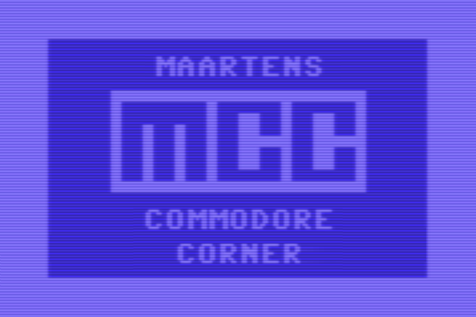
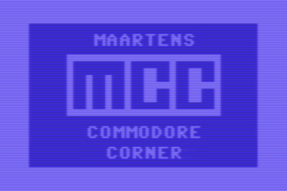
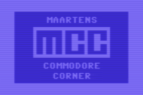

# MCC - Maartens Commodore Corner

Some of the [C64 howto's](https://github.com/maarten-pennings/C64howto) have appeared as articles in 
[Clubblad Info Bulletin](https://commodore.hcc.nl/downloads/publiek/clubblad-info-bulletin) 
of the [HCC Commodore](https://commodore.hcc.nl/) chapter in the Netherlands.

## Overview

This is an overview of articles published in the series _Maartens Commodore Corner_.

| MCC issue | Info Bulletin                                                                                                              | GitHub Dutch                                                                                                          | GitHub English                                                                                       |
|:----------|:---------------------------------------------------------------------------------------------------------------------------|:----------------------------------------------------------------------------------------------------------------------|:-----------------------------------------------------------------------------------------------------|
|     5     | 2027 mar (#2) planned                                                                                                      | not yet available                                                                                                     | Recursion in BASIC                                                                                   |
|     4     | 2027 jan (#1) planned                                                                                                      | not yet available                                                                                                     | [Commodore 64 rows versus lines](https://github.com/maarten-pennings/C64howto/tree/main/rowsvslines) |
|     3     | 2026 dec (#6) planned                                                                                                      | not yet available                                                                                                     | [REU](https://github.com/maarten-pennings/C64howto/tree/main/reu)                                    |
|     2     | 2026 okt (#5) submitted                                                                                                    | [Blinky1541](https://github.com/maarten-pennings/C64howto/blob/main/blinky1541/blinky1541-nl.md)                      | [Blinky1541](https://github.com/maarten-pennings/C64howto/tree/main/blinky1541)                      |
|    1b     | [2026 feb (#1) part 2](https://commodore.hcc.nl/downloads/publiek/clubblad-info-bulletin/1211-infobulletin-2026-02/file)   | [C64 geheugen verdelen.pdf](https://github.com/maarten-pennings/howto/blob/main/c64mempart/C64-geheugen-verdelen.pdf) | [C64 Memory partitioning](https://github.com/maarten-pennings/howto/tree/main/c64mempart)            |
|    1a     | [2025 dec (#6) part 1](https://commodore.hcc.nl/downloads/publiek/clubblad-info-bulletin/1219-infobulletin-2025-12-1/file) | [C64 geheugen verdelen.pdf](https://github.com/maarten-pennings/howto/blob/main/c64mempart/C64-geheugen-verdelen.pdf) | [C64 Memory partitioning](https://github.com/maarten-pennings/howto/tree/main/c64mempart)            |

## MCC logo

### 960 × 640

### 480 × 320

### 240 × 160

(end)
