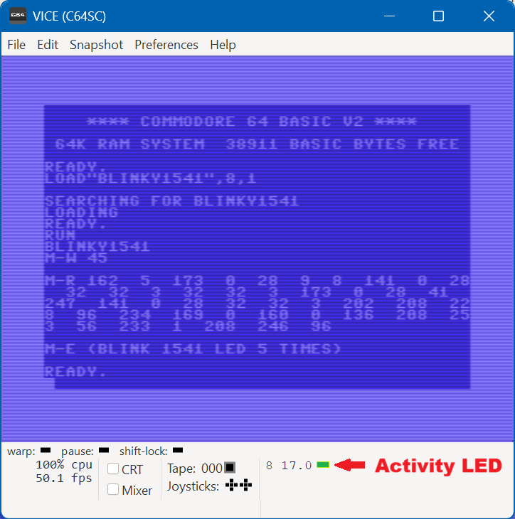

# Blinky1541
Maarten Pennings, Juli 2026

_Blinky1541_ is een machinetaal programma dat runt op de 1541 disk drive;
het laat de _activity LED_ van de 1541 vijf keer knipperen.

Dit artikel is een verkorte Nederlandse versie van een engels artikel.
Dat bevat meer details en bijvoorbeeld ook source files.

> [https://github.com/maarten-pennings/C64howto/blob/main/blinky1541/readme.md](https://github.com/maarten-pennings/C64howto/blob/main/blinky1541/readme.md). 


## Introductie

De Commodore 1541 disk drive wordt een _smart peripheral_ genoemd.
Het is eigenlijk een computer op zichzelf; het kleine broertje van de C64:
het heeft een 6502 CPU, 16 kB ROM, 2 kB RAM en 2 VIAs.

In dit artikel gaan we een programma voor de 1541 schrijven.
Zoals "Hello, World" het eerste programma is dat je schrijft voor een 
nieuwe programmertaal, is Blinky het eerste programma voor nieuwe hardware.
Een Blinky laat een LED knipperen.

_Blinky1541_ wordt een 6502 machine taal programma. 
De C64 _upload_ het naar de 1541. Als de 1541 het programma uitvoert
zal de "_activity LED_" van de 1541 vijf keer knipperen.


## _activity LED_

Op [https://www.zimmers.net](https://www.zimmers.net)
vinden we schemas en documentatie voor de 1541 drive.
Daar leren we dat de _activity LED_ met de anode aan de 5V verbonden is
en met de kathode door een _inverter_ aan pin PB3 van VIA 2. Met andere woorden,
als PB3 hoog is zorgt de _inverter_ voor een lage kathode, en de LED gaat aan.

Op dezelfde site vinden we de _memory map_ van de 1541.
Daaruit leren we dat `control port B` (om de PBx pinnen laag of hoog te trekken)
op adres $1C00 is ligt. PB3 is dus bit drie op dat adres.

We weten nu dat het op 1 zetten van bit 3 op adres $1C00 de LED aan zet 
terwijl een 0 op die plek de LED uit zet. Rest nog een vraag, waar 
plaatsen we het Blinky programma zelf?

In memory map op Zimmers zien we dat de 1541 vijf buffers heeft.
Deze RAM buffers worden gebruikt om disk sectors te lezen of te schrijven.
Zolang we geen file `LOAD`,`SAVE` of `OPEN` doen heeft de 1541 firmware die 
buffers niet nodig. De buffers staan op pagina 3 (0300-03FF) tot en met 
pagina 7 (0700-07FF). Wij gaan de eerste buffer gebruiken.
 

## Het blinky programma


Zoals een Blinky betaamd, schrijven we een _kort_ programma.
Omdat we alleen bit 3 van $1C00 willen veranderen doen we een zogeheten 
_read-modify-write_: we lezen $1C00, maskeren bit 3 naar één en schrijven 
het resultaat terug naar $1C00. In assembler wordt dat 
`LDA $1C00; OR #$08; STA $1C00` (omdat we bits vanaf 0 tellen staat PB3 op de _vierde_ plaats).

We doen hetzelfde om het bit weer naar nul te schrijven. Omdat het
anders te snel gaat roepen we na elke schrijf actie een subroutine aan (`JSR $0320`) 
die executie vertraagt (een "wait"). We kiezen voor een dubbele "wait" bij LED aan.

Dit is het complete assembler programma:

```asm
0300 | 162,5     | LDX #$5

0302 | 173,0,28  | LDA $1C00
0305 | 9,8       | ORA #$08
0307 | 141,0,28  | STA $1C00
030A | 32,32,3   | JSR $0320
030D | 32,32,3   | JSR $0320

0310 | 173,0,28  | LDA $1C00
0313 | 41,247    | AND #$F7
0315 | 141,0,28  | STA $1C00
0318 | 32,32,3   | JSR $0320

031B | 202       | DEX
031C | 208,228   | BNE $0302
031E | 96        | RTS

031F | 234       | NOP

0320 | 169,0     | LDA #$00
0322 | 160,0     | LDY #$00
0324 | 136       | DEY
0325 | 208,253   | BNE $0324
0327 | 56        | SEC
0328 | 233,1     | SBC #$01
032A | 208,246   | BNE $0322
032C | 96        | RTS
```

- De wacht ("wait") routine bevindt zich op $0320. 
  Deze routine gebruikt register X niet; dat is belangrijk omdat het 
  hoofdprogramma die gebruikt om af te tellen dat er 5 "blinks" zijn.
  De wachttijd van twee geneste 256-loops is ongeveer 0.33 seconde.
- Het hoofdprogramma staat op $0300.
- Register X telt de "blinks" af: 
  X krijgt zijn beginwaarde op $0300, de aftelling is op $031B en de loop sprong terug staat op $031C.
- Op 0302-030D wordt de _activity LED_ 2×0.33 seconde aangezet (bit 3 van $1C00 wordt hoog gemaakt).
- Op 030D-0315 wordt de _activity LED_ 0.33 seconde uitgezet (bit 3 van $1C00 wordt laag gemaakt).


## De C64 uploader

In deze sectie bekijken we het _upload_ programma voor de C64, geschreven in BASIC.
Het bevat het Blinky programma van de vorige sectie in `DATA` statements.
We gebruiken het DOS commando "M-W" (_memory write_) om Blinky in het 
1541 geheugen te schrijven, en daarna "M-E" (_memory execute_) om Blinky uit 
te laten voeren. Ter controle hebben we ook nog een "M-R" (_memory read_)
om het geschreven programma terug te lezen.

Alle drie de _memory_ opdrachten moeten gevolgd worden door een extra argument:
het adres (waar de bytes geschreven, gelezen, uitgevoerd moeten worden).
Dat zijn twee bytes in _little endian_ vorm, dat wil zeggen het 
_least significant byte_ eerst.

De schrijf en lees opdracht hebben daarna nog een argument: een byte 
dat de lengte van de te schrijven/lezen data aangeeft.

Hieronder volgt het hele programma.

```basic 
10 PRINT "BLINKY1541"
12 OPEN 1,8,15:REM PENNINGS 20260720
20 AL=0:AH=3:A$=CHR$(AL)+CHR$(AH):D$=""
22 READD:IFD>=0THEND$=D$+CHR$(D):GOTO22
30 L=LEN(D$):PRINT "M-W";L
32 FOR I=0 TO L-1 STEP 32
34 :C$=MID$(D$,I+1,32):L$=CHR$(LEN(C$))
36 :PRINT#1,"M-W"CHR$(I)CHR$(AH);L$;C$;
38 NEXT I:PRINT
40 PRINT"M-R";:PRINT#1,"M-R"A$;CHR$(L);
42 FOR I=1 TO L
44 :GET#1,B$:PRINT ASC(B$+CHR$(0));
46 NEXT I:PRINT:PRINT
50 PRINT "M-E (BLINK 1541 LED 5 TIMES)"
52 PRINT#1,"M-E";A$
60 CLOSE 1:END
70 DATA 162,5,173,0,28,9,8,141,0,28,32
72 DATA 32,3,32,32,3,173,0,28,41,247
74 DATA 141,0,28,32,32,3,202,208,228,96
76 DATA 234,169,0,160,0,136,208,253,56
78 DATA 233,1,208,246,96,-1
```

- De regels 1x (regels 10 en 12) openen het disk drive commando kanaal (kanaal 15 op apparaat 8).
- De regels 2x bouwen de string `D$` die het Blinky programma bevat, gelezen van de `DATA` regels.
  String `A$` is het adres ($0300) dat elk commando mee krijgt.
- De regels 3x doen meerdere _memory writes_ "M-W" van stukken van `D$` naar de disk. 
  Meerdere _memory writes_ zijn nodig omdat een opdracht maximaal 40 bytes mag bevatten.
- De regels 4x zijn overbodig, ze lezen het zojuist geschreven Blinky programma 
  terug van de disk drive - alleen maar ter controle.
- Op regels 5x wordt het programma uitgevoerd.
  De _activity LED_ blinkt vijf keer.
- Op regel 6x sluit het disk kanaal en eindigt het BASIC programma. 
- De `DATA` regels 7x bevatten het 1541 Blinky programma in 6502 assembler.
  
Dit program werkt op de echte C64 met de echte 1541 drive;
maar ook op de echte C64 met de Pi1541 drive emulator; 
en zelfs op VICE.




(end)
