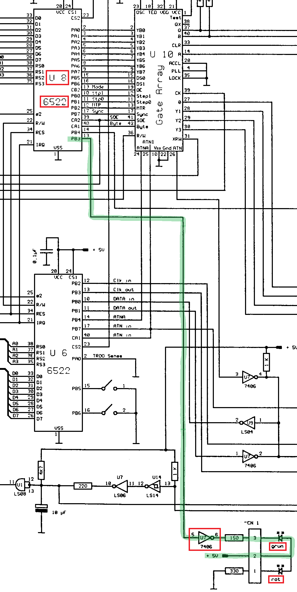

# Blinky1541

How to make a program for the Commodore 1541 that blinks the activity LED.


## Introduction

When learning a new programming language, the first program written is typically "Hello, world!".
This assumes a system that can display strings: a `print` library function and a screen to show the printed message.
If the system misses either, the first program is typically "Blinky".
The Blinky program blinks an LED connected to the CPU.

Surely the Commodore 64 falls into the first category (`10 PRINT "HELLO, WORLD!"`).
For sure. However, in this article, we are going to program the _Commodore 1541 disk drive_. 
It has a 6502, RAM, 6522 VIAs and even an LED connected to the VIA. We are going to blink that LED.


## Blinky program

Our first task is to write the Blinky program. We do that in this section.
Next section is about how to get the program on the 1541 and run it there.


### LED control

We want to write a Blinky for the 1541 disk drive.
We need to know _how to control the activity LED_.

On Zimmers we find the 
[schematics of the 1541-ii](https://www.zimmers.net/anonftp/pub/cbm/schematics/drives/new/1541/1541-II.340503.gif). 
Here is an extract.



- On the 1541-ii the activity LED is _green_ (`grun`) and the power LED is _red_ (`rot`), 
  which is the reverse of the original 1541.
- The green LED is connected with its anode to 5V, so it is _low active_.
- The cathode is connected to port `PB3` of the VIA 6522 (U8).

Also on Zimmers we find the [memory map](https://www.zimmers.net/anonftp/pub/cbm/maps/C1541ram.txt).
Here is an extract

```
VIA 2: 6522, port for motor and read/write head control
------------------------------------------------------

$1C00	PB, control port B
$1C01	PA, port A (data to and from read/write head)
$1C02	CB, data direction port B
$1C03	CA, data direction port A

    PB 7:	SYNC IN
    PB 6,5:	Bit rate D1 and D0
    PB 4:	WPS - Write Protect Sense (1 = On)
    PB 3:	ACT - LED on drive
    PB 2:	MTR - drive motor
    PB 0,1:	step motor for head movement

    CA 1:	Byte ready
    CA 2:	SOE - Set Overflow Enable for 6502
    CA 3:	read/write
```

- At address $1C02 we find the `data direction port B`, it determines wether a pin of port B is input or output.
- At address $1C00 we find the `control port B`, i.e. the value for the pins of port B.
- The table confirms that the `ACT - LED` is PB3.

> Assuming that the initialization of the drive sets the data direction register such that PB3 is output,
> the only thing our Blinky program has to do is _clear_ bit 3 to enable the activity LED or _set_ bit 3 to disable the LED.


### Program location 

In the same [memory map](https://www.zimmers.net/anonftp/pub/cbm/maps/C1541ram.txt) on Zimmers
we find some other interesting addresses:

```
0104 - ff	Stack area

0200 - 29 	Buffer for command string

0300		Buffer 0
0400		Buffer 1
0500		Buffer 2
0600		Buffer 3
0700		Buffer 4

07ff		End of RAM
```

- It tells us that the 1541 has 2 kbyte RAM (8 pages, $0000-$07ff).
- Page 0 (0000-00ff) is in use as zero-page.
- Page 1 (0100-01ff) is used as stack.
- Page 2 (0200-02ff) is for general administration.
- More specificaslly, we see that the command buffer is $29 or 42 bytes.
- Pages 3, 4, 5, 6, and 7 ar sector buffers.

> We will use page 3 (Buffer 0) to store our program.


### The code

Now that we know we need to manipulate bit 3 in 1c00, and 
we decided the store our program in page 3 (0300), we are ready to 
write our Blinky program.

We hand assemble using Maaswerk's [6502 instructions](https://www.masswerk.at/6502/6502_instruction_set.html).

```
0300 | 162,5     | ldx #$5
0302 | 173,0,28  | lda $1c00
0305 | 41,247    | and #$f7
0307 | 141,0,28  | sta $1c00
030a | 32,32,3   | jsr $0320
030d | 173,0,28  | lda $1c00
0310 | 9,8       | ora #$08
0312 | 141,0,28  | sta $1c00
0315 | 32,32,3   | jsr $0320
0318 | 202       | dex
0319 | 208,231   | bne $0302
031b | 96        | rts
031c | 234       | nop
031d | 234       | nop
031e | 234       | nop
031f | 234       | nop
0320 | 169,0     | lda #$00
0322 | 160,0     | ldy #$00
0324 | 136       | dey
0325 | 208,253   | bne $0324
0327 | 56        | sec
0328 | 233,1     | sbc #$01
032a | 208,246   | bne $0322
032c | 96        | rts
```

- At 0320 we have a wait routine. It keeps register X unmodified.
- The wait takes about 0.33 seconds.
- The main routine starts at 0300.
- Register X is used to loop 5 times on/off. it is set st 0300 and decremented at 0318 and looped at 0319.
- At 0302-030a the activity LED is switched on (by clearing bit 3 of 1c00) for 0.33s.
- At 030d-0315 the activity LED is switched off (by setting bit 3 of 1c00) for 0.33s.


## Upload and execute

With our first task completed (writing the Blinky program) this section
focusses on how to get the program on the 1541 and run it there.
We do that via the command channel.


### Commands in general

Recall that we can _send commands_ to a 1541.
We do that by opening a byte pipe (file handle), any "slot" will do, 
in the example below we picked `1`.
The file is on a specific device, below `8` for the disk drive.
Commodore drives have one channel reserved for commands: `15`.

In the example we send the command `S` to delete ("scratch") a file.
It has as argument `HELLO` (the filename). First we create and save that file.

```basic
10 PRINT "HELLO, WORLD!"
RUN
HELLO, WORLD!

READY.
SAVE "HELLO",8

SAVING HELLO
READY.
OPEN 1,8,15,"S:HELLO":CLOSE 1

READY.
```

The above command `OPEN 1,8,15,"S:HELLO"` is a shorthand for the following lines
which more clearly shows that we send `"S:HELLO"` to file 1, the command channel 15 of drive 8.

```basic
OPEN 1,8,15
PRINT#1,"S:HELLO"
CLOSE 1
```

It is also possible to _receive feedback_ from the drive.
We use either `INPUT#` or `GET#`.
Typically we get back the drive _status_.

```basic
10 OPEN 1,8,15
20 PRINT#1,"S:HELLO"
30 INPUT#1,EN,EM$,ET,ES
40 PRINT EN;EM$;ET;ES
50 CLOSE 1

RUN
 1 FILES SCRATCHED 1  0
```

The above example scratches the file `HELLO` and then checks 
for success (`FILES SCRATCHED 1`).
It is good to realize that the `INPUT#` function is high-level.
It parses the bytes from the disk, using `,` as field separator, 
character 13 (CR) as line separator, and even parses integers 
(e.g. `"00"` becomes `0`). 

For full control it is better to replace `INPUT#` by `GET#` and extract 
the raw bytes one by one.

```basic
10 OPEN 1,8,15
20 PRINT#1,"S:HELLO"
30 GET#1,B$
40 PRINT B$;
50 IF B$<>CHR$(13) THEN GOTO 30
60 CLOSE 1

RUN
01, FILES SCRATCHED,01,00
```

Having said that, `GET#1,B$` has one flaw. If the byte being read is 0, `B$` is `""`
instead of `CHR$(0)`. The usual work around is `30 GET#1,B$:B=0:IF B$<>"" THEN B=ASC(B$)` or the 
slightly faster (without filling the string heap) concatenation:

```basic
30 GET#1,B$:B=ASC(B$+CHR$(0))
```


### Programmer's commands

Next to the high level disk commands (`SAVE` and `LOAD`) and the advanced
commands (e.g. `S` for scratch, `N` for new (format), `R` for rename), there
are Programmer's commands. We will investigate three of them write (`M-W`),
read (`M-R`) and execute (`M-E`). At first they sound complex, but they are 
not. However, there are many small issues that make them hard to master.

```basic
100 print "disk write/read"
110 a$=chr$(0)+chr$(3):rem addr lo/hi
120 open 8,8,15,"i0"
190 :
200 for d=65 to d+3:w$=w$+chr$(d):next
210 print#8,"m-w";a$;chr$(len(w$));w$;
220 print" w>";:gosub 500
290 :
300 l=16:print#8,"m-r";a$;chr$(l);
310 get#8,d$:d=asc(d$+chr$(0))
320 if st<>0 then 360
330 r1$=r1$+mid$(str$(d),2)+" "
340 if d<33 or d>127 then d=asc(".")
350 r2$=r2$+chr$(d):goto310
360 print" r>";:gosub 500
370 print r1$:print r2$
390 :
400 close 8
410 end
490 :
500 print "st=";st;"dos=";
510 input#8,en,em$,et,es
520 if en>9 then print en;em$;et;es
530 if en<10 then print "ok"
540 return
```
(this program is presented in lower case to make copy and paste in VICE easier).


The 1xx section is the start, 2xx the write to memory, 3xx the read 
from memory, the 4xx is the stop section, and 5xx is error subroutine.
In more detail:

- 110 variable `A$` is two bytes, first byte is 0, second byte is 3, the 
  string contains the address $0300 in little enidan format.
  It is used as address in the `M-W` and `M-R` commands.
- 120 opens the command channel of drive 8 in "slot" (logical file number) 8.
  We also send an initialize-drive command (not necesary, but doesn't harm).
- Line 200 builds string `w$` which will be written to the drive memory.
  It contains 4 characters 65..68, or A, B, C, D.
- Line 210 actually writes those bytes to the drive RAM.
  `M-W` is the command, next two bytes form the start address 
  (0300 or the first buffer). This is followed by the number of bytes that 
  will be written; and finally come the bytes.
- Line 220 is error feedback.
- Line 300 sends the memory read command to the drive.
  The `M-R` is alsof followed by the target address 
  (again 0300, where we have just written `W$`) and 
  also the number of bytes we want to read. 
  Here we use `L=16`, so we read 16 bytes, but we wrote only 4.
- Line 310 is the start of the read loop. We read one byte in `D$`,
  and use the `""`-workaround to convert it to ASCII in variable `D`.
- Line 320 breaks the loop if we are at end-of-file (`ST=64`).
- Line 330 builds a string (`R1$`) of read ASCII values, 
  lines 340 and 350 build a string (`R2$`) of read characters.
- Line 360 is error feedback.
- Line 370 prints the read bytes in the two forms.
- Lines 400 and 410 close the file and end the program.

This is the typical output when we run the program. We see the written 
four characters, followed by 12 zeros (my drive was just reset).

```
DISK WRITE/READ
 W>ST= 0 DOS=OK
 R>ST= 64 DOS=OK
65 66 67 68 0 0 0 0 0 0 0 0 0 0 0 0
ABCD............
```


### Issues with "M-W"

There are several issues with the "M-W" command.
We will make small changes to the above program and see how this 
effects the behavior. Feel free to skip this section.

I did reset (my virtual) drive on every experiment, 
you might see other (non-0) left-overs in the buffer.


#### Issue 1: relaxed len byte

When the length byte is less than the number of bytes written, 
the written data is truncated to the specified length.

```basic
210 print#8,"m-w";a$;chr$(len(w$)-1);w$;
```

Although `w$` is `"abcd"`, only `"abc"` is written to the 1541 memory,
due to the length byte being 3:

```
65 66 67 0 0 0 0 0 0 0 0 0 0 0 0 0
abc.............
```

When the length byte is greater than the number of bytes written, 
only the _passed_ data is written. What we will see in the "chunking"
issue is that only the data from a single `PRINT#` is used, which 
made me wonder _why_ we need to pass the length.

```basic
210 print#8,"m-w";a$;chr$(len(w$)+1);w$;
```

Although the length byte is 5, the print transfers only 4 bytes (`w$="abcd"`),
so only those four are written to the 1541 memory.

```
65 66 67 68 0 0 0 0 0 0 0 0 0 0 0 0
abcd............
```


#### Issue 2: chunking

When more than a handful of bytes needs to be written, it is 
tempting to `PRINT#` multiple chunks. That does _not_ work;
all bytes to be written must be part of one single `PRINT#`.
For a remedy, see "repeating".

```basic
210 print#8,"m-w";a$;chr$(len(w$)*2);w$;
211 print#8,w$;
```

Although the length byte is 8, and we write 8 bytes 
(twice `w$` which is `"abcd"`), only the first `print#` 
is written into the 1541 memory.

```
65 66 67 68 0 0 0 0 0 0 0 0 0 0 0 0
abcd............
```


#### Issue 3: syntax


Chunking does not work, so how to pass many bytes?
The main example alreay showed it; build a string (`W$` in the example).
Multiple strings (or even `CHR$()`) can be passed in one `PRINT`.

```basic
210 print#8,"m-w";a$;chr$(len(w$)+1+len(w$));w$;chr$(48);w$;
```

The arguments of `print#` are `w$`, a character 48 (`0`), and again `w$`,
all are transfered to the 1541 memory.

```
65 66 67 68 48 65 66 67 68 0 0 0 0 0 0 0
abcd0abcd.......
```

For some reason `PRINT` doesn't need the `;` (but see issue "terminating CR").

```basic
210 print#8,"m-w"a$chr$(len(w$)+1+len(w$))w$chr$(48)w$;
```

Arguments of `print#` do not need `;`:

```
65 66 67 68 48 65 66 67 68 0 0 0 0 0 0 0
abcd0abcd.......
```

Of course we could explicitly concatenate the strings, but that 
is probably more computation and memory heavy.

```basic
210 print#8,"m-w"+a$chr$(len(w$)+1+len(w$))+w$+chr$(48)+w$;
```

The `print#` has one big argument, a concatenation of multiple strings.

```
65 66 67 68 48 65 66 67 68 0 0 0 0 0 0 0
abcd0abcd.......
```

Do not use the `,` though. In BASIC's `PRINT`, the comma moves to the 
next tab. The `PRINT` implements tab by inserting spaces.

The example below prints two strings ``"AB"` and `"CD"`, but they are 
separated by a `,` (instead of a `;`, `+`, ` `, or nothing). We pass 
a length that is hopefully long enough (30, relying on the "relaxed len byte").

```basic
210 print#8,"m-w";a$;chr$(30);"ab","cd";
```

The `,` inroduces 10 spaces (character 32):

```
65 66 32 32 32 32 32 32 32 32 32 32 67 68 0 0
ab..........cd..
```


#### Issue 4: terminating CR

Every `PRINT` _adds_ a CR, _unless_ the statement 
is terminated with a `;`. The same holds for `PRINT#`.


```basic
210 print#8,"m-w";a$;chr$(len(w$)+5);w$
```

The absence of a trailing `;` causes a trailing CR (13):

```
65 66 67 68 13 0 0 0 0 0 0 0 0 0 0 0
abcd............
```


#### Issue 5: command buffer limit

The command buffer in the drive has a limited size. 
As we saw earlier the buffer is located at 0200-0229.
This means it is $2A bytes long. In other words a command 
has a maximum size of 42. 

Since the memory write command starts with "M-W" (3 bytes), 
then 2 bytes for the address, and 1 for the length, the command 
itself is already 6 bytes. This leaves 36 for the data itself.

Writing 35 bytes works:

```basic
200 for d=65 to d+34:w$=w$+chr$(d):next
...
300 l=40:print#8,"m-r";a$;chr$(l);
```

We see that 35 bytes are written (65..99):

```
disk write/read
 w>st= 0 dos=ok
 r>st= 64 dos=ok
65 66 67 68 69 70 71 72 73 74 75 76 77 7
8 79 80 81 82 83 84 85 86 87 88 89 90 91
 92 93 94 95 96 97 98 99 0 0 0 0 0
abcdefghijklmnopqrstuvwxyz[\]^_.ABC.....
```

But 36 is too much. 
I can not explain why it doesn't stop at 37.

```basic
200 for d=65 to d+35:w$=w$+chr$(d):next
```

We get an error, `32 syntax error`:

```
 w>st= 0 dos= 32 syntax error 0  0
 r>st= 64 dos=ok
0 0 0 0 0 0 0 0 0 0 0 0 0 0 0 0
................
```


#### Issue 6: repeating

So, what if we want to write more than 35 bytes?
Repeat the "M-W" command to different addresses.


```basic
210 print#8,"m-w";chr$(0);chr$(3);chr$(5);w$;chr$(48);
211 print#8,"m-w";chr$(5);chr$(3);chr$(5);w$;chr$(49);
```

The fragment writes 5 bytes (ABCD0) to 0300, then 5 bytes (ABCD1) to 0305.

```
65 66 67 68 48 65 66 67 68 49 0 0 0 0 0 0
abcd0abcd1......
```


### Issues with "M-R"

There are also issues with the "M-R" command.
We will make small changes to our test program and see how this 
effects the behavior. Feel free to skip this section.

I did reset (my virtual) drive on every experiment, 
you might see other (non-0) left-overs in the buffer.


#### Issue 1: two forms

There are two forms for the memory read command.
One that has an explicit length byte (as used in the main example),
and one that has no explicit length byte.

```basic390 :
300 l=16:print#8,"m-r";a$;
```

In the latter case, only one byte is read.

```
disk write/read
 w>st= 0 dos=ok
 r>st= 64 dos=ok
65
a
```


#### Issue 2: len 13 unsupported

This issue I nearly consider a _bug_.
When the length byte has the value 13,
the 1541 treats this as a single byte read.

```basic 
300 l=13:print#8,"m-r";a$;chr$(l);
```

```
disk write/read
 w>st= 0 dos=ok
 r>st= 64 dos=ok
65
a
```

In other words `print#8,"m-r";a$;chr$(13);` and `print#8,"m-r";a$` behave the same.


#### Issue 3: end-of-file behavior

Note the lines 310 and 320.

```basic
310 get#8,d$:d=asc(d$+chr$(0))
320 if st<>0 then 360
... processing...
350 goto 310
```

Line 310 reads a byte (into `d$`).
Line 320 checks if end-of-file is set, if so, exits byte reading (jump to line 360).

This means that end-of-file flags the first illegal read.
This is the normal `feof()` behavior in C, so why complain?
As [bumbershootsoft](https://bumbershootsoft.wordpress.com/2017/09/23/c64-basic-disk-io/#:~:text=Unlike%20feof()%20in%20C%2C%20though%2C%20this%20is%20is%20set%20on%20the%20last%20legal%20read%2C%20not%20the%20first%20illegal%20one.%20That%20makes%20the%20loop%20logic%20look%20a%20bit%20different%20than%20we%20might%20otherwise%20expect.)
explains the behavior of end-of-file in BASIC is different:

> "Unlike feof() in C, though, ST is set on the last legal read, not the first illegal one."

The program below demonstrates the normal behavior - a `repeat-until` instead of the above `while-do`.

```
100 open15,8,15
110 print "write"
120 open 3,8,3,"data,seq,w"
130 print#3,"abcde";
140 close 3
150 print "read"
160 open 3,8,3,"data,seq,r"
170 get#3,d$:d=asc(d$+chr$(0))
180 printd;:if st=0 then 170
190 close 3
```

```
write
read
 65  66  67  68  69
ready.
```


## Links

- Pagetable [Commodore Peripheral Bus: Part 3: Commodore DOS](https://www.pagetable.com/?p=1038).
- Zimmers [memory map](https://www.zimmers.net/anonftp/pub/cbm/maps/C1541ram.txt).
- Zimmers [schematics of the 1541-ii](https://www.zimmers.net/anonftp/pub/cbm/schematics/drives/new/1541/1541-II.340503.gif). 
- Maaswerk [6502 instructions](https://www.masswerk.at/6502/6502_instruction_set.html).

(end)
