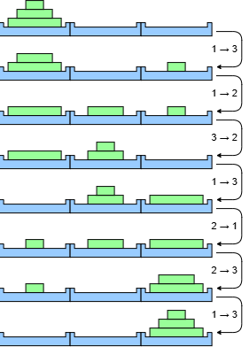
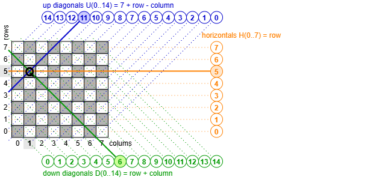
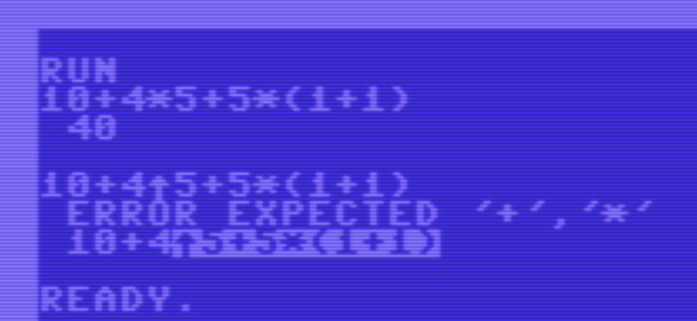

# Recursion in BASIC

Can we use _recursion_ in Commodore 64 BASIC?

As this article explains, the answer is yes.
However, recursion is a bit harder than in more modern 
programming languages.


## Introduction

Commodore 64 BASIC was my first programming language.
I didn't know the terminology yet, but I learned the _assignment statement_ 
(`LET`), that it knows about the order of the operations (`*` before `+`) and 
that it uses and changes the value of _variables_. I learned that you can `INPUT` 
and `PRINT` variables. 

There was the relatively high-level `FOR`-`NEXT` statement. 
Then there was the `IF` statement. It is less high-level because 
the "room" for the `THEN` is one line and there is no `ELSE` branch.
Both shortcomings can only be remedied if you're willing to throw 
in a low-level `GOTO`. 

And finally there was the magic `GOSUB`, the `GOTO` that remembers 
to `RETURN` where it came from. Made for _subroutines_.

I had no idea you could have named subroutines ("functions") nor that 
subroutines could have arguments or use local variables (on a stack).
As a result I had no clue that a thing called _recursion_ existed.

I learned about recursion much later. Looking back, I wondered if recursion 
is at all possible on the C64. Not having subroutine arguments on a 
stack seems blocking.

In this article we first look at three toy problems that we solve 
recursively in C64 BASIC. They teach us the concepts we need for 
real problems. Then we have a quick detour looking at the C64 stack.
Finally we solve three real problems recursively.


## Theory

In this chapter we use toy problems to understand how to apply recursion 
in BASIC. In real life, none of the presented problems should be solved recursively.
The stack soon becomes a limiting factor, and execution speed is also 
heavily impacted.

But the presented problems are well known, and easy to understand, so they don't 
distract us when we learn the recursion concepts.


### Power of 2

The first problem we are going to solve recursively is to compute 
powers of two. More specifically, we want a _subroutine_ that computes 
the value `2^N` recursively.

In BASIC we don't have functions with arguments or a return value, so 
we need to use global variables for both. Our subroutine will have an 
input `N`. This means that the caller must assign a value to variable 
`N` before the `GOSUB` to the subroutine. The subroutine will (recursively) 
compute `2^N` and assign the result to a global variable, in our 
case `R` (from "result"). After the return, the calles must inspect `R`.

The above paragraph describes the "signature" of the subroutine:
which values go in (in which variables) and which values go out 
(in which variables). One thing is still missing in the "signature" 
description: which global variables are used as scratch pad, i.e. 
modified (overwritten) by the subroutine, but not having a meaningful 
value after return. This is needed because all variable are global, so 
overwriting a variable that is used by the caller will cause havoc.

In our case, `N` is modified by the subroutine. 
The complete signature is specified on line 200.

> This program is listed in lower case to make copy&paste to VICE easier.
> It is available as `1-POW2` on the [disk](recursion.d64).

```basic
100 print "pow2"
110 i=0
120 :n=i:gosub 200:print "2^";i;"=";r
130 :i=i+1
140 goto 120
150 :
200 rem inp:n; out:r=2^n; mods:n
210 if n=0 then r=1:return
220 n=n-1
230 gosub 200
240 r=r*2
250 return
```

The body of the subroutine (lines 210-250) 
implements the base case (`N=0`, line 210) and the recursive case 
(`N>0`, lines 220-250):

```
pow2(0)= 1
pow2(n)= pow2(n-1)*2, if n>0
```

Well, implementing the `POW2()` subroutine was not too hard.

Lines 100-140 test the subroutine.
Since `N` is modified by the subroutine, we can not use `N` in the 
main loop, hence we use a fresh loop variable `I`.
On line 120, the variable (argument) `N` is assigned before the `GOSUB`, 
afterwards the variable (result) `R` is used (to `PRINT`).

```
pow2
2^ 0 = 1
2^ 1 = 2
2^ 2 = 4
2^ 3 = 8
2^ 4 = 16
2^ 5 = 32
2^ 6 = 64
2^ 7 = 128
2^ 8 = 256
2^ 9 = 512
2^ 10 = 1024
2^ 11 = 2048
2^ 12 = 4096
2^ 13 = 8192
2^ 13 = 8192
2^ 14 = 16384
2^ 15 = 32768
2^ 16 = 65536
2^ 17 = 131072
2^ 18 = 262144
2^ 19 = 524288
2^ 20 = 1048576
2^ 21 = 2097152
2^ 22 = 4194304
2^ 23 =
?out of memory  error in 210
ready.
```

There is an intentional bug in the program: the main loop is infinite;
line 140 jumps back to 120. However, the program does terminate. When `N=23` 
the recursion is so deep that the stack space is exhausted and we get and 
`OUT OF MEMORY ERROR`.

Should we call something a "bug" when it was intentional?


### Factorial

The previous program was _too_ easy. 
It might give the impression that recursion is fully supported 
in C64 BASIC.

Let's step up the complexity: we want a subroutine that computes 
the value `N!` recursively. Recall that `!` denotes the _factorial_ 
operator defined as 

```
fac(0)= 1
fac(n)= fac(n-1)*n, if n>0
```

This differs very little from `POW2`, why is this harder?

Our subroutine will have an input `N`.
The subroutine will (recursively) compute `N!` and 
assign that to the global variable `R`.
Let us assume, as in `POW2`, that the signature includes that `N` 
is on the mods-list (is modified by the subroutine).
And we recycle the `POW2` code as follows.

```basic 
200 rem inp:n; out:r=n!; mods:n
210 if n=0 then r=1:return
220 n=n-1
230 gosub 200
240 r=r*n
250 return
```

This does _not_ work. The problem is in line 240.
After the `GOSUB` on line 230, global variable `N` is modified (to an 
unspecified value), so the assignment `r=r*n` does not compute what we want.

We need to change the signature of `FAC(N)` to no longer use `N` as 
scratch variable, but to keep (retain) its value. That is the new spec 
of our subroutine, see line 200 below (`KEEP:N`). 

> This program is listed in lower case to make copy&paste to VICE easier.
> It is available as `2-FAC` on the [disk](recursion.d64).

```basic 
100 print "fac"
110 n=0
120 :gosub 200
130 :print n;chr$(157);"! =";r
140 :n=n+1
150 goto 120
160 :
200 rem inp:n; out:r=n!; keep:n
210 if n=0 then r=1:return
220 n=n-1
230 gosub 200
240 n=n+1:rem restore n
250 r=r*n
260 return
```

Fortunately, it is easy to implement the changed spec. 
For the case `N=0` (line 210), global variable `N` is not overwritten, so 
no need to update that line.
For the case `N>0` (line 220-260), `N` is decremented on line 220.
Line 230 has the recursive call, _which now guarantees that the value 
of `N` is retained_ and that `R=(N-1)!`. So we only need to add line 240, which increments `N` 
to restore its original value. This makes the assignment on line 250 
correct, and allows us to `RETURN` on line 260, because `N` and `R` now 
both adhere to the signature.

```
fac
 0! = 1
 1! = 1
 2! = 2
 3! = 6
 4! = 24
 5! = 120
 6! = 720
 7! = 5040
 8! = 40320
 9! = 362880
 10! = 3628800
 11! = 39916800
 12! = 479001600
 13! = 6.2270208e+09
 14! = 8.71782912e+10
 15! = 1.30767437e+12
 16! = 2.09227899e+13
 17! = 3.55687428e+14
 18! = 6.40237371e+15
 19! = 1.216451e+17
 20! = 2.43290201e+18
 21! = 5.10909422e+19
 22! = 1.12400073e+21
?out of memory  error in 210
ready.
```

`FAC(N)` has the same intentional bug as `POW2(N)`: the main loop is infinite.
Also this program terminates with an `OUT OF MEMORY ERROR` due to a stack overflow.


### Fibonacci

In `FAC(N)` we learned that we sometimes need to retain values by restoring them.
Unfortunately it is not always possible to do so easily, e.g. with a simple 
"repair expression" like `N=N+1`.

We will see this in our next toy example, Fibonacci, defined as follows
(see [wikipedia](https://en.wikipedia.org/wiki/Fibonacci_sequence) for details).

```
fib(0)= 0
fib(1)= 1
fib(n)= fib(n-1) + fib(n-2), if n>1
```

Our subroutine has an input `N`.
The subroutine (recursively) computes `FIB(N)` and 
assign that to the global variable `R`.
As before, we make sure that the value of `N` is retained.
The subroutine has two scratch variables `R0` and `R1`.

```basic 
200 rem inp:n; out:r=fib(n); keep:n; mods:r0,r1
210 if n<2 then r=n:return
220 n=n-1:gosub 200:r0=r
240 n=n-1:gosub 200:r1=r
250 r=r0+r1
260 n=n+2:rem restore n
270 return
```

The program above is a first attempt. Retaining the value of `N` is easy.
But the crux of this example is in `R0` and `R1`. Both are overwritten by the 
subroutine, both are part of the mods-list. And when `R0` is 
on the mods-list, the second `GOSUB 200` (line 240) modifies `R0`, so line 
250 is incorrect. 

By the way, there is no `GOSUB 200` between `R1=R` and `R=R0+R1`, so that 
`R1` is on the mods-list is not a worry. We can easily see that by modifying 
out first attempt:

```basic 
200 rem inp:n; out:r=fib(n); keep:n; mods:r0
210 if n<2 then r=n:return
220 n=n-1:gosub 200:r0=r
240 n=n-1:gosub 200
250 r=r+r0
260 n=n+2:rem restore n
270 return
```

How do we restore global variable `R0` after the second 
subroutine call  (`GOSUB 200` on line 240)? That is not easy. `R0` is 
_computed_ so it is not a simple matter of restoring a decrement. 

The solution is to add a _stack_. In the program below, `S()` is the stack, 
and `S` is the stack pointer. Since arrays (`S()`) and scalars (`S`) are in 
a different name space (array versus scalar), we can use the same 
identifier (`S`). This is similar to having `S`, `S$` and `S%`. 
The stack is created on line 110 in the program below.

> This program is listed in lower case to make copy&paste to VICE easier.
> It is available as `3-FIB` on the [disk](recursion.d64).

```basic
100 print "fib"
110 dim s(30):s=0:rem setup stack
120 n=0
130 :t0=ti:gosub 200:t1=ti:t=(t1-t0)/60
140 :print "fib(";n;")=";r;
150 :f=1:if l>0 then f=t/l
160 :print int(t);chr$(157);"s(*";f;")"
170 :n=n+1:l=t
180 goto 130
200 rem inp:n; out:r=fib(n); keep:n,s
210 if n<2 then r=n:return
220 n=n-1:gosub 200
230 s(s)=r:s=s+1:rem push r
240 n=n-1:gosub 200
250 s=s-1:r=r+s(s):rem pop r
260 n=n+2:rem restore n
270 return
```

Line 210 is for the base cases (`N=0` and `N=1`); the base case leaves `N` and `S` unmodified.
Line 220 computes `FIB(n-1)` whose result `R` is _pushed_ on the stack (line 230).
Line 240 computes `FIB(n-2)` whose result `R` is incremented with the value popped from the stack (line 250).
This also restores the stack pointer `S`.
Line 260 restores `N`.
This completes the subroutine.

We have a main loop similar to the ones before, except that it is augmented 
with _time_ recording code. Line 130 calls the subroutine, but takes a timestamp before 
(`T0`) and after (`T1`) the call, to compute the execution time (`T`) in 
seconds (the `/60` converts jiffies to seconds).

Line 140 prints the function call and result.
Line 160 prints the execution time `INT(T)`.
One extra feature is that line 150 computes a factor:
the ratio of the current execution time and the previous execution time.
The factor is also printed on line 160.

```
fib
fib( 0 )= 0  0s(* 1 )
fib( 1 )= 1  0s(* 1 )
fib( 2 )= 1  0s(* 3 )
fib( 3 )= 2  0s(* 1.66666667 )
fib( 4 )= 3  0s(* 2 )
fib( 5 )= 5  0s(* 1.7 )
fib( 6 )= 8  0s(* 1.64705882 )
fib( 7 )= 13  0s(* 1.67857143 )
fib( 8 )= 21  1s(* 1.65957447 )
fib( 9 )= 34  2s(* 1.64102564 )
fib( 10 )= 55  3s(* 1.625 )
fib( 11 )= 89  5s(* 1.625 )
fib( 12 )= 144  9s(* 1.62130178 )
fib( 13 )= 233  14s(* 1.62043796 )
fib( 14 )= 377  23s(* 1.6204955 )
fib( 15 )= 610  38s(* 1.61917999 )
fib( 16 )= 987  62s(* 1.61802575 )
fib( 17 )= 1597  101s(* 1.61856764 )
fib( 18 )= 2584  164s(* 1.61832186 )
fib( 19 )= 4181  266s(* 1.61802532 )
fib( 20 )= 6765  430s(* 1.61816247 )
fib( 21 )= 10946  697s(* 1.61813963 )
fib( 22 )= 17711  1128s(* 1.61823267 )

?out of memory  error in 250
ready.
```

`FIB(N)` has the same intentional bug as `POW2(N)` and `FAC(N)`: the main loop is infinite.
Also this program terminates with an `OUT OF MEMORY ERROR` due to a stack overflow.

> Computing Fibonacci numbers using a recursive 
> algorithm is a bad idea. We can see that from the timing: `FIB(22)` takes 
> 1128 seconds which is nearly 20 minutes!
> 
> The reason for this long execution time is that computing `FIB(N)` recursively takes `2*FIB(N+1)-1` calls 
> (see [paper](https://courses.grainger.illinois.edu/cs374al1/fa2025/notes/03-dynprog.pdf)).
> Fibonacci numbers grow exponentially (see [wiki](https://en.wikipedia.org/wiki/Fibonacci_sequence#Computation_by_rounding)):
> `FIB(N) ~ 1.618^N / 2.236`, so the _computation time grows exponentially_ too.
> We see that back in the ratios printed by the BASIC program, it matches 1.618.
> 
>   |  N    | 0 | 1 | 2 | 3 | 4 |  5 |  6 |  7 |  8 |   9 |  10 |  11 |  12 |  13 |   14 |   15 |   16 |   17 |   18 |    19 |    20 |    21 |    22 |
>   |:------|--:|--:|--:|--:|--:|---:|---:|---:|---:|----:|----:|----:|----:|----:|-----:|-----:|-----:|-----:|-----:|------:|------:|------:|------:|
>   | FIB   | 0 | 1 | 1 | 2 | 3 |  5 |  8 | 13 | 21 |  34 |  55 |  89 | 144 | 233 |  377 |  610 |  987 | 1597 | 2584 |  4181 |  6765 | 10946 | 17711 |
>   | calls | 1 | 1 | 3 | 5 | 9 | 15 | 25 | 41 | 67 | 109 | 177 | 287 | 465 | 753 | 1219 | 1973 | 3193 | 5167 | 8361 | 13529 | 21891 | 35421 | 57313 |
> 
> The recursive alorithm is _exponential_. 
> A simple iterative algorithm is _linear_ in `N`. 
> It is even possible to compute `FIB(N)` using a _logarithmic_ [algorithm](https://en.wikipedia.org/wiki/Fibonacci_sequence#Matrix_form).


## Stack

The last toy example introduced a stack `S()`.
That was used to store intermediate values (`R0` in the Fibonacci example).
However all programs used a stack, the stack which is part of BASIC, 
which relies on the stack offered by hardware: the stack of the 6510 CPU.

It is good to know that BASIC uses the 6510 stack not only for `GOSUB`, but also 
for, for example, `FOR`-`NEXT`, for expression evaluation `2*(3+4)`, and 
for interrupts, e.g. the keyboard scan.

The following program nests a couple of `FOR`-`NEXT` loops, and `GOSUB`s to 
see how many bytes they consume from the 6510 stack. We wrote a two-instruction 
assembly routine to retrieve the 6510 stack pointer.

> This program is listed in lower case to make copy&paste to VICE easier.
> It is available as `4-STACK` on the [disk](recursion.d64).

```basic 
100 print "initial stack"
110 gosub 900
120 :
200 print "stack use 'for'"
210 for i=0 to 0:gosub 900
220 for j=0 to 0:gosub 900
230 for k=0 to 0:gosub 900
240 :
300 print "'for's closed"
310 next i
320 gosub 900
330 :
400 print "stack use 'gosub'"
410 gosub 450:end
420 :
450 gosub 900
460 gosub 450
470 :
900 rem print stackpointer
910 poke 49152,186:rem tsx
920 poke 49153, 96:rem rts
930 sys  49152    :rem x=s
940 sa=peek(781)  :rem sa=s
950 print sa;     :rem print s
960 print sl-sa   :rem print delta
970 sl=sa:return  :rem sl=s "last"
```

- It should be noted that the 6510 stack is hardwired 
  to be in page 1 of the memory: from $0100 to $01FF.
  The high byte (page) is fixed ($01), the low byte is determined by the CPU 
  register S (the stack pointer). This S register grows from $FF downwards.
  
- The subroutine starting at line 900 uses a small assembly program to 
  retrieve the 6510 stack pointer S and print it, together with the delta 
  to the previous value.
  
- Line 110 contains the first `GOSUB 900` printing the initial stack pointer 
  value. It also prints the delta but that does not make sense here 
  because there was no previous stack pointer yet.

- The initial value appears to be 239; not exactly 255 ($FF) but close (16 btes off).
  Our BASIC program and the BASIC interpreter are running, so there 
  might be some values on the stack - but I don't know which.
  
```
initial stack
 239 -239
stack use 'for'
 221  18
 203  18
 185  18
'for's closed
 239 -54
stack use 'gosub'
 232  7
 225  7
 218  7
 211  7
 204  7
 197  7
 190  7
 183  7
 176  7
 169  7
 162  7
 155  7
 148  7
 141  7
 134  7
 127  7
 120  7
 113  7
 106  7
 99  7
 92  7
 85  7
 78
?out of memory  error in 960
ready.
```

- Next come three nested `FOR`-`NEXT` loops (lines 210, 220, and 230).
  Each take a whopping 18 bytes of the stack. As [Mapping the C64](https://archive.org/details/Compute_s_Mapping_the_Commodore_64/page/n61/mode/2up)
  explains there is 1 byte for a tag (129), 2 bytes for a pointer to the loop variable, 
  5 bytes for the STEP value, 1 byte for the STEP sign, 5 bytes for the 
  TO value, and finally 2 bytes for the line number and 2 bytes for the address, 
  both linking to the first statement of the FOR loop.
  
- A `NEXT` statement of an outer FOR loop 
  [cancels all inner FOR loops](https://www.c64-wiki.com/wiki/FOR).
  This is what happens on line 310, so line 320 prints 239 again.
  
- The final test is on line 400: an infinite recursion of the routine 450.
  A GOSUB uses 7 bytes ([C64-wiki](https://www.c64-wiki.com/wiki/Subroutine)). 
  Again 1 for a tag (141), 2 bytes for the line number and 2 bytes for the 
  address, both linking to the statement after the GOSUB, and finally 2 bytes for a JSR 
  overhead.
  
- Note that the 23rd call raises the `OUT OF MEMORY ERROR`.
  This is the exact same value we found for the three toy examples.
  I do not fully understand why BASIC indicates the stack is empty 
  with a pointer well above 0, namely at 78.
  
  [Mapping the C64](https://archive.org/details/Compute_s_Mapping_the_Commodore_64/page/n59/mode/2up)
  suggest that BASIC uses $0100-$010A of the stack area for floating point 
  conversions, and the KERNEL uses $0100-$013E for tape handling.
  This means the stack can grow down to $3F or 63. I'm guessing, BASIC reserves
  78-63 = 15 bytes for other administrative purposes.
  
  This guess is supported by `FIB(22)`. We get the error `OUT OF MEMORY  ERROR IN 250` and 
  line 250 is _not_ a `GOSUB` but an assignment (`r=r+s(s)`). I suspect that 
  evaluating an expression uses stack space on top of the space used by the 
  `GOSUB`s.
  
> **Conclusion** The C64 BASIC interpreter uses the 6510 stack for tracking 
> returns of `GOSUB`s.
> It can only handle about 22 nested `GOSUB`s, which is insufficient for 
> programs like the toy examples where the nesting depth is determined by the 
> argument of subroutine.


## Real applications

The chapter [Theory](#theory) explains that for recursion in BASIC we need to 
_restore_ the value of global variables, maybe with the help of an additional 
stack, i.e. an array created by the programmer. That chapter also explains that 
BASIC uses the 6510 stack, which supports a maximum call depth of 22.

In this chapter we will show that real problems can still be solved with 
recursion in BASIC. We look at three applications: the towers of Hanoi, 
8 queens and an expression parser.


### Towers of Hanoi

"Towers of Hanoi" is a famous puzzle 
(see [wiki](https://en.wikipedia.org/wiki/Tower_of_Hanoi)). 
It consists of 3 pins (piles).
There are towers (stacks) of disks on the pins. 
Each disk has a different diameter.
The games starts with `N` disks on pin 1.
The goal is to move the tower of `N` disks to pin 3, following theses rules:

- Only one disk can be moved at a time.
- Only the top most disk of a pin can be moved.
- A disk is moved to either an empty pin, or to the top of a pin whose 
  top most disk is larger then the disk being moved.

The diagram below shows the 7 steps needed to move a tower of 3 disks 
from pin 1 to pin 3. The arrows are labeled with the action per step: 
_f→t_ means a disk is moved from pin _f_ to pin _t_.



This puzzle is easily solved with recursion.
We will develop a subroutine that prints the steps to move a tower 
of `N` disks from pin `F` (_from pin_) to pin `T` (_to_ pin). 
Note that there is a third pin, the _spare_ pin.

- If `N` is 0, the subroutine is done without printing any step.
- If `N` is greater than 0, we split the work in three phases:
  - Recursively ask to move a tower of `N-1` disk from `F` to the _spare_ pin.
  - Move the `N`th disk from `F` to `T`.
  - Recursively ask to move a tower of `N-1` disk from the _spare_ pin to `T`.

We convert this to a BASIC subroutine.
We make sure to retain the values of the variables `N`, `F`, and `T` over 
a subroutine call. There is one small trick: to compute the index of 
the spare pin we use the expression `6-T-F`. Observe that an assignment 
like `T=6-T-F` swaps the _to_ and the _spare_ pin, another `T=6-T-F` swaps 
them back.

> This program is listed in lower case to make copy&paste to VICE easier.
> It is available as `5-HANOI` on the [disk](recursion.d64).

```basic 
100 print "hanoi"
110 f=1:t=3:n=3:gosub 200
120 end
130 :
200 rem inp :f=1,2,3 t=1,2,3 t<>f n>=0
210 rem out :printed steps to move n
220 rem      disks from pin f to pin t
230 rem keep:f,t,n
240 if n=0 then return
250 t=6-f-t:n=n-1:gosub 200
260 t=6-f-t:print f;">";t
270 f=6-f-t:gosub 200
280 f=6-f-t:n=n+1:return
```

This is the output.

```
hanoi
 1 > 3
 1 > 2
 3 > 2
 1 > 3
 2 > 1
 2 > 3
 1 > 3
```

There is a second version on the [disk](recursion.d64), 
called `5-HANOIX`, it doesn't print the steps but the towers 
between the steps. The letters denote disks of various sizes.

```
hanoix
[abc [ [
[ab [ [c
[a [b [c
[a [bc [
[ [bc [a
[c [b [a
[c [ [ab
[ [ [abc
```

As we see, it is straightforward to code this classical puzzle in BASIC.
We must only adhere to the rule to retain the values of the variables 
over a subroutine call.


### 8 Queens

The "8 queens" puzzle is also famous 
(see [wiki](https://en.wikipedia.org/wiki/Eight_queens_puzzle)). 
The goal is to place eight chess queens on an 8×8 chessboard so that no queen attacks another.
Problems like these are often solved using _recursive backtracking_.
We want to try to do this in BASIC.

We can reformulate the problem:
the rows, columns and (up and down) diagonals each have at most one queen.

We will develop a subroutine that has as input a partial board `B()`: 
its first `C` columns hold a queen 
(for a _column_ `X`, with `X<C`, `B(X)` is the _row_ where the queen is placed).
The subroutine will complete the partial board (putting one queen in each of 
the remaining columns `X`, `C≤X<8`) in all possible ways 
and print those completed boards where no queen attacks another.

To be able to quickly decide if a queen can be added in column `C` 
we maintain three arrays: `U()` for the "up diagonals", 
`D()` for the "down diagonals", and `H()` for the "horizontals".
There is no need to maintain an array for the verticals, because by construction of 
the algorithm, there is one queen per column (per vertical).
For up diagonal with index `I`, `U(I)` will be 0, if and only if up diagonal `I` is free,
i.e. no queen on the partially filled board lies on that diagonal.
The same holds for `D()` and `H()`.

Given a queen position, it is easy to compute the indexes of the up diagonal and the down diagonal.
The down diagonal index is the _sum_ of the row and column
and the up diagonal index is the _difference_ of the row and column 
(with an offset 7 to stay positive).
See the diagram for the example where the queen is placed in column 1 and row 5,
occupying up diagonal 11 (blue), down diagonal 6 (green), and horizontal 5 (orange).



> This program is listed in lower case to make copy&paste to VICE easier.
> It is available as `6-8QUEENS` on the [disk](recursion.d64).

```basic 
10 print "8 queens"
12 dim b(7),h(7),u(14),d(14)
14 t0=ti:c=0:gosub 28:t1=ti
16 print (t1-t0)/60:end
18 :
20 rem inp :0<=c<=8 b(0..c-1)
22 rem out :printed completions of b
24 rem      where no queen attack other
26 rem keep:c,b,h,u,d
28 if c=8 then gosub 50:return
30 b(c)=0
32 :if h(b(c)) then 44
34 :if d(b(c)+c) then 44
36 :if u(7+b(c)-c) then 44
38 :h(b(c))=1:d(b(c)+c)=1:u(7+b(c)-c)=1
40 :c=c+1:gosub 28:c=c-1
42 :h(b(c))=0:d(b(c)+c)=0:u(7+b(c)-c)=0
44 b(c)=b(c)+1:if b(c)<8 then 32
46 return
48 :
50 for x=0 to 7:print b(x);:next
52 n=n+1:print "#";n:return
```

- The program creates the arrays for the board (`B()`), 
  the horizontals (`H()`), up diagonals (`U()`) and down 
  diagonals (`D()`) on line 12.

- The initial recursive call is on line 14.
  Argument `C` is 0, meaning that the partial board `B()` is empty (0 columns filled).
  `T0` and `T1` record the start and end time of the subroutine call.
  Line 16 prints the total execution time in seconds.

- The recursive backtracking subroutine is on lines 20-46.
  When the board is complete (when `C` is 8) we found a solution.
  The subroutine at line 50 is called which prints the solution 
  (stepping the solution number `N`).
  
- If the board is not yet complete (`C<8`) the subroutine tries 
  to place a queen in column `C`.
  It loops over all rows from 0 (line 30) upto 8 (line 44).
  In lines 32-42 we have a candidate location for the queen at coordinates (`C`,`B(C)`).
  We compute the three indices: `B(C)` for the horizontals,
  `B(C)+C` for the down diagonals and `7+B(C)-C` for the up diagonals.

- Lines 32, 34 and 36, checks if the queen would be on a line that is under attack.
  If so, the next row is tried for the queen (`THEN 44`).

- If the queen is not under attack, the three arrays are updated for the 
  new queen location (line 38) and the subroutine is called recursively (line 40).
  After the call the three arrays are reversed (cleared) again (line 42).  

This is the tail of the printed output.

```
 6  3  1  4  7  0  2  5 # 86
 6  3  1  7  5  0  2  4 # 87
 6  4  2  0  5  7  1  3 # 88
 7  1  3  0  6  4  2  5 # 89
 7  1  4  2  0  6  3  5 # 90
 7  2  0  5  1  4  6  3 # 91
 7  3  0  2  5  1  6  4 # 92
 544.75
```

Our BASIC program finds 92 solutions, the same amount as 
mentioned on the [wiki](https://en.wikipedia.org/wiki/Eight_queens_puzzle).
It took my C64 545 seconds or 9 minutes.

There is a second version on the [disk](recursion.d64), 
called `6-8QUEENSX`, it prints 2D boards instead of a list of row numbers.
This is the tail of the printed output;
the boards are printed sideways: column 0 is the first printed row.

```
	.......q
	..q.....
	q.......
	.....q..
	.q......
	....q...
	......q.
	...q....
	# 91

	.......q
	...q....
	q.......
	..q.....
	.....q..
	.q......
	......q.
	....q...
	# 92
	 574.65
```

8 Queens proves that BASIC allows us to implement recursive backtracking.


### Expression parser

The final real application is a so-called [LL(1)](https://en.wikipedia.org/wiki/LL_parser) 
parser implemented using _recursive descent_ algorithm. 

This is quite a mouth full. What it boils down to is that you can enter a string 
`I$="10+4*5+5*(1+1)"`, call the evaluator (`GOSUB 200`), and `PRINT E` will print 
`40`. The evaluator knows about precedence: `*` goes before `+`, but also 
supports parenthesis `(`..`)` to overrule that.

To keep the example manageable, the evaluator only supports `+`, `*`, `(`..`)`
and integer numbers like `123`. No subtraction of division, no negative numbers 
or functions. But it does have rather clear error reporting.

We will write a _Parse_ subroutine (line 300) that takes as argument a 
string `E$`, evaluate that, and return the value in `E`. 
Unless there is an error, then _Parse_ prints the error and stops.

Recursion lends itself quite well for expression evaluation.
For example, to evaluate `E$="2*3+4*5"`, we might recursively evaluate 
`E$="2*3"` (returning to `E=6`) and `E$="4*5"` (returning to `E=20`). 
Next we need to add `6` and `20`, assign that to `E` and return. 
However, the second `GOSUB` for `E$="4*5"` does overwrite the global 
variable `E`, so we would loose the `E=6` from the first `GOSUB`. 
We solve this by introducing an explicit stack `E()` with stack pointer `S`.

An LL(1) parser decides what to do looking at the next 1 tokens.
In our simple parser a token is character. The parser _Parse_  
will "eat" the tokens one by one from (the head of) string `E$`. 
The code maintains `H$=LEFT$(E$,1)`, so decisions can be made by 
inspecting `H$`.

An LL(1) parser must always have a 1 character look ahead. Therefore
there is a wrapper _Eval_ (line 200) that appends a sentinel (terminator) 
token to `E$`; we have chosen `"$"` as sentinel.

The structure of an recursive descend parser is to have a subroutine per 
precedence level. We have three levels: addition (`+`, we could add `-`) 
at line 300, multiplication (`*`, we could add `/`) at line 400, and 
atoms at line 500. We have two kind of atoms: parenthesized expressions 
(line 500-520) and literal numbers (530-570). We could add variables or 
functions as atoms.

The routine at line 900 is _PrintError_. It prints the error string 
passed in argument `M$`, shows what the parser already successfully 
parsed and what is still to parse but failed (in reverse video).
Then it aborts.

The routine at line 800 is _SkipToken_. It checks if `E$` starts 
with token `S$` (argument). If not it reports an error. If so, it 
"eats" (removes) token `S$` from `E$`, and updates `H$` to be the next 
token to parse.

> This program is listed in lower case to make copy&paste to VICE easier.
> It is available as `7-EXPR` on the [disk](recursion.d64).

```
100 dim e(20):s=0:rem expression eval
110 i$="10+4*5+5*(1+1)"
120 print i$:gosub 200:print e:print
130 i$="10+4^5+5*(1+1)"
140 print i$:gosub 200:print e:print
150 end
190 :
200 e$=i$+"$":gosub 830:gosub 300
210 if h$="$" then return
220 m$="expected '+','*'":goto 900
290 :
300 gosub 400
310 if h$<>"+" then return
320 e(s)=e:s$="+":gosub 800
330 s=s+1:gosub 400:s=s-1
340 e=e(s)+e:goto 310
390 :
400 gosub 500
410 if h$<>"*" then return
420 e(s)=e:s$="*":gosub 800
430 s=s+1:gosub 500:s=s-1
440 e=e(s)*e:goto 410
490 :
500 if h$<>"(" then 530
510 s$="(":gosub 800:gosub 300
520 s$=")":gosub 800:return
530 if h$<"0" or h$>"9" then 580
540 n$=""
550 n$=n$+h$:s$=h$:gosub 800
560 if h$>="0" and h$<="9" then 550
570 e=val(n$):return
580 m$="expect '(','0'..'9'":goto 900
590 :
800 if left$(e$,len(s$))=s$ then 820
810 m$="missing '"+s$+"'":goto 900
820 e$=mid$(e$,len(s$)+1)
830 h$=left$(e$,1):return
890 :
900 print " error ";m$:l=len(e$)-1
910 print " ";left$(i$,len(i$)-l);
920 print chr$(18);left$(e$,l)chr$(154)
```

Some additional notes 

- Line 100 defines the stack `E()` and initializes stack pointer `S`.

- Line 110 assigns an expression to evaluate, line 120 prints it, calls 
  _Eval_ (line 200), and prints the result. Lines 130 and 140 are 
  similar, but here `I$` has a syntax error: using operator `^`.
  
- Line 200 appends the sentinel to the string `E$`, which will be 
  processed by _Parse_ (line 300). The `GOSUB 830` is a "hack" to 
  initialize the head token `H$`. 
  
  At the end of parsing, `E$` should be empty - be just the sentinel.
  That is handled in 210 and 220.

- Line 300 starts the _Parse_ subroutine; 300-390 is for addition ("terms"), 
  400-490 for multiplications ("factors") and 500-590 for atoms.
  
- Line 300 parses the left-hand side of a `+` sign (`GOSUB 400`), 
  and line 330 the right-hand side (another `GOSUB 400`).
  Line 320 pushes the left-hand `E` on the stack `E(S)=E` and it 
  eats the `"+"` from `E$` using `S$="+":GOSUB 800`.
  Line 330 contains the recursive call for the right-hand side 
  keeping the  stack pointer in sync.
  Line 340 implements the actual addition `e=e(s)+e`.
  Since an addition might have more than two terms (`1+2+3`), 
  the addition parser loops back `GOTO 310`.
  
- The 400 multiplication part is similar to the 300 addition part.

- The atoms are dealt with in 500. Parenthesized expressions on line 500-520.
  Numbers on line 530-570.

Here is a table of the variables that are used.

  |variable| contents/usage                                                  |
  |:------:|:----------------------------------------------------------------|
  |  `E()` | stack                                                           |
  |   `S`  | stack pointer                                                   |
  |        |                                                                 |
  |  `I$`  | expression input by user - never modified, arg for _Eval_ (200) |
  |  `E$`  | copy of `I$`, parser eats leading chars, arg for _Parse_ (300)  |
  |  `H$`  | convenience variable: the head char of `E$`                     |
  |  `E`   | result returned by _parse_ (300) - value of `E$`                |
  |        |                                                                 |
  |  `S$`  | argument for _SkipToken_ (800), what to skip                    |
  |  `M$`  | argument for _PrintError_ (900), the error message              |
  |        |                                                                 |
  |  `N$`  | helper only used to parse an integer number                     |
  |  `L`   | helper only used to print error (parser position)               |

Here is the output of `7-EXPR`.




## Conclusion

It takes a bit more effort in BASIC than it would in more modern languages, 
but _recursive backtracking_ and a _recursive descent parser_ are possible 
in C64 BASIC.


## Links

- [Fibonnaci on wikipedia](https://en.wikipedia.org/wiki/Fibonacci_sequence).
- [Towers of hanoi on wikipedia](https://en.wikipedia.org/wiki/Tower_of_Hanoi). 
- [8 Queens on wikipedia ](https://en.wikipedia.org/wiki/Eight_queens_puzzle). 
- [FOR loops on C64-wiki](https://www.c64-wiki.com/wiki/FOR).
- [GOSUB on C64-wiki](https://www.c64-wiki.com/wiki/Subroutine). 
- [Stack usage in Mapping the C64](https://archive.org/details/Compute_s_Mapping_the_Commodore_64/page/n61/mode/2up).
- [LL(1) parser](https://en.wikipedia.org/wiki/LL_parser).
- The [disk](recursion.d64) contains `1-POW2`, `2-FAC`, `3-FIB`, `4-STACK`, `5-HANOI`, `5-HANOIX`, `6-8QUEENS`, `6-8QUEENSX`, `7-EXPR`.


(end)

