# REU

In 1985 Commodore released the [REU](https://www.c64-wiki.com/wiki/REU) 
or **R**AM **E**xpansion **U**nit. I got a [Kung Fu Flash 2](https://codeberg.org/KimJorgensen/KungFuFlash2) cartridge 
and that [claims](https://codeberg.org/KimJorgensen/KungFuFlash2#:~:text=Kung%20Fu%20Flash%202%20can%20emulate%20a%201%20Mb%20REU) 
to incorporate a REU. I was wondering if I could use that REU, maybe even from BASIC.

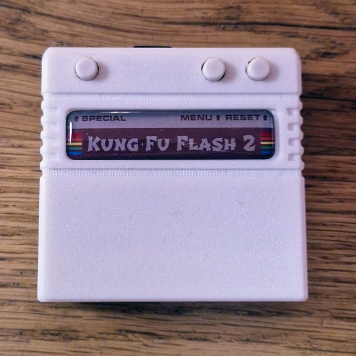

If you don't have a kung Fu Flash 2, do not despair. 
The [Commodore 64 Ultimate](https://commodore.net/computer/#:~:text=16%20MB%20system%2C-,16%20MB%20REU,-%2C%2016%20MB%20GeoRAM)
and [TheC64](https://c64os.com/c64os/usersguide/viceconfiguration_thec64#:~:text=Enables%20an%20REU%20with%20the%20maximum%20of%2016MB)
both contains a REU. And even VICE emulates a REU.


## Introduction

A REU contains several blocks of RAM, each 64k byte.
The smallest Commodore REU is the "Commodore 1700 REU"; 
it contains 2 blocks of 64 kbyte or 128 kbyte.
The "Commodore 1764 REU" contains 4 blocks or 256 kbyte.
The biggest one from Commodore is the "Commodore 1750 REU", it contains 8 blocks or 512 kbyte.
The "Kung Fu Flash 2" REU contains 16 blocks or 1024 kbyte or 1 Mbyte.
The maximum size possible, fitting to the current REU register API, 
would be 256 blocks of 64 kbyte or 16 Mbyte.

A REU does _not_ use a banking mechanism, in the sense that it 
replaces a part of the C64 RAM by a (selectable) part of the REU.
The REU's memory is _not_ accessible by the 6510 processor of the C64.
Instead the REU is a memory mapped device, 
with 11 control and status registers mapped at 0xDF00.
Via those registers, the 6510 gives the REU a _command_ 
to _stash_ some of the C64's data into the REU,
or to _fetch_ some data from the REU and store it in the C64 RAM.
There are two more command: _swap_ and _compare_, 
but let's postpone those for a while.
This document will use the terms _copy_ and _transfer_ for these
four operations interchangeably. 


## Registers

The [C64 memory map](https://www.c64-wiki.com/wiki/Memory_Map) 
reserves addresses D000-DFFF for memory mapped I/O devices.
The REU is typically mapped to the region known as "I/O 2", which starts at DF00.
I/O 2 occupies 256 bytes, but the REU has only seven registers spanning 11 bytes.
Some registers are 1, some 2 and one is even 3 bytes wide.

  | Register   | Size | Offset | Hex  | Dec   | Link                               |
  |:----------:|:----:|:------:|:----:|:-----:|:----------------------------------:|
  | `status`   |   1  |    0   | DF00 | 57088 | [section](#status-0-df00-57088)    |
  | `command`  |   1  |    1   | DF01 | 57089 | [section](#command-1-df01-57089)   |
  | `c64base`  |   2  |   2,3  | DF02 | 57090 | [section](#c64base-23-df02-57090)  |
  | `reubase`  |   3  |  4,5,6 | DF04 | 57092 | [section](#reubase-456-df04-57092) |
  | `translen` |   2  |   7,8  | DF07 | 57095 | [section](#translen-78-df07-57095) |
  | `irqmask`  |   1  |    9   | DF09 | 57097 | [section](#irqmask-9-df09-57097)   |
  | `addrctrl` |   1  |   10   | DF0A | 57098 | [section](#addrctrl-10-df0a-57098) |

Each register is descibed in more detail in the sections below - or click in the last column above.


### status @0 ($DF00, 57088)

The status register indicates the status of the last transfer(s).
The status flags (3 MSB) are cleared upon read. 

  | Bits | Function          | Details                                                            |
  |:----:|:-----------------:|:-------------------------------------------------------------------|
  |   7  | INTERRUPT PENDING | 1 = interrupt needs servicing; only when INTERRUPT ENABLE is set   |
  |   6  | END OF BLOCK      | 1 = transfer completed; flags completion of all 4 transfer types   |
  |   5  | FAULT             | 1 = compare failed; only for transfer type compare                 |
  |   4  | SIZE              | obsolete (0 for 128k, 1 for >= 256k)                               |
  |  3:0 | VERSION           | obsolete (version number of Commodore REUs)                        |


The REU stalls the 6510 while transferring, so once the 6502 "unstalls", 
the REU has completed transfer. In other words checking the END OF BLOCK is superfluous. 
Instead of `200 if peek(57088) and 64 then 200` I would suggest to use `200 wait 57088,64` if
you insist on checking END OF BLOCK.

The stalling of the 6510 also means that the INTERRUPT PENDING flag in register `irqmask`
(interrupts are enabled) is not needed.

The 4 LSB bits are obsolete for modern REUs.

what is left is the FAULT bit, they only useful one. It indicates a difference is found when the REU transfer 
runs in _compare_ mode.


### command @1 ($DF01, 57089)

The command register allows the 6510 to instruct the REU to _start_ a transfer. 
The source and destination addresses (and size) need to be set beforehand.

  | Bits | Function          | Details                                                            |
  |:----:|:-----------------:|:-------------------------------------------------------------------|
  |   7  | EXECUTE           | writing 1 starts a transfer (of type TRANSFER TYPE)                |
  |   6  | reserved          |                                                                    |
  |   5  | LOAD              | 1 = `c64base`, `reubase`, `translen` are reloaded after completion |
  |   4  | NOFF00            | 1 = start immediately, 0 = wait for write to $FF00                 |
  |  3:2 | reserved          |                                                                    |
  |  1:0 | TRANSFER TYPE     | 00=stash (C64 to REU), 01=fetch (REU to C64), 10=swap, 11=compare  |

There are four types of transfers.
The transfer type _stash_ transfers data from the C64 memory to the REU memory.
The transfer type _fetch_ transfers data from the REU memory to the C64 memory.
The transfer type _swap_ exchanges the data in the C64 memory with the data in the REU memory.
The transfer type _compare_ compares data from the C64 memory with data in the REU memory
(no writes, only reads). If there is a difference the FAULT-bit in the status register is set. 

During a transfer the `c64base` and `reubase` are incremented by one and `translen` decremented by one 
for every transferred byte. At the end of the transfer `c64base` is `translen` higher, `reubase` is 
`translen` higher and `translen` is 1 (not 0). When the LOAD bit is clear that is how you see
the registers when the transfer stops. When LOAD is set, the `c64base`, `reubase`, `translen` are 
reloaded with their initial value. Note that for a compare, a transfer stops either at the end,
when no difference is found, or is aborted mid-way when a difference is found. In the latter case,
executing with LOAD clear makes sense, because then we know at which location the first difference 
was found, see [example compare](#compare).

Some memory regions of the C64 are in [triple use](https://www.c64-wiki.com/wiki/Memory_Map).
For example DF00 could be RAM, I/O 2, or character ROM.
The REU, when executing a transfer, sees the memory that is configured as active.
This means that the REU could never access the RAM or character ROM also present at DF00;
it would only see the I/O 2 needed to control it.
To solve this, EXECUTE can be postponed by clearing the NOFF00 flag.
When clear, the actual transfer is delayed; it starts only after writing to address FF00, 
presumably after the active memory has been changed. I don't know why FF00 was chosen.

I would recommend to have LOAD always set (except for compare mode).
I would also recommend to have NOFF00 always set (except when comparing a memory "under" I/O 2.


### c64base @2,3 ($DF02, 57090)

The `c64base` is a two-byte register containing the address for the _C64 side_ of the transfer operation.
For a _stash_ command it functions as the _source_ address, for a _fetch_ command it functions as the _destination_ address.
The address is in little endian format: the LSB is at offset 2 and the MSB is at offset 3.


### reubase @4,5,6 ($DF04, 57092)

The `reubase` is a three-byte register containing the address for the _REU side_ of the transfer operation.
For a _stash_ command it functions as the _destination_ address, for a _fetch_ command it functions as the _source_ address.
The address is in little endian format: the LSB is at offset 4 and the MSB is at offset 6.

Some documents call the byte at offset 6 a "bank", with offset 4 and 5 denoting the offset within that 64 kbyte bank.
That is confusing term because the REU has a _continuous_ memory from 0x00 0000 to 0xFF FFFF (assuming a 1M byte REU).


### translen @7,8 ($DF07, 57095)

The `translen` is a two-byte register containing the number of bytes for the transfer operation.
The transfer length is in little endian format: the LSB is at offset 7 and the MSB is at offset 8.

A `translen` of 0000 means 65536 bytes.
 

### irqmask @9 ($DF09, 57097)

The REU has two events: transfer completed and compare failed.
When such an event happens, the associated bit in the status register 
is set (END OF BLOCK respectively FAULT).

It is possible to generate an interrupt (IRQ, not NMI) when these bits are set.
To enable these interrupts, make sure their enable mask is set in `irqmask`.
Secondly, globally enable interrupts by setting INTERRUPT ENABLE.

  | Bits | Function          | Details                                                            |
  |:----:|:-----------------:|:-------------------------------------------------------------------|
  |   7  | INTERRUPT ENABLE  | 1 = trigger IRQ when one of below events happen and is enabled     |
  |   6  | END OF BLOCK MASK | 1 = enable IRQ when status END OF BLOCK is set                     |
  |   5  | FAULT MASK        | 1 = enable IRQ when status FAULT is set                            |
  |  4:0 | reserved          |                                                                    |

If an event happens, and its mask is set, and INTERRUPT ENABLE is set, the IRQ is fired.
It is vectored (6510 hardware) at FFFE. The C64 kernal ROM maps that to FF48, which pushes 
the registers and then vectors via $0314/$0315 (for a hardware IRQ; alternatively via 
$0316/$0317 for a BRK, as determined via the B flag in PSW). By default 314/315 
routes to $EA31 (e.g. keyboard scan). One would need to write an ISR (REU handler) 
which **clears the interrupt** by reading `status` at $DF00, and then continuous at $EA31. 
If the interrupt is not cleared, it will fire again as soon as the RTI at the end of 
the EA31 ISR is executed. This will lock up the C64. **Setting INTERRUPT ENABLE without installing an ISR that clears `status` locks the C64**.

Although this interrupt mechanism exists, it is fairly useless.
The 6510 is halted during the REU transfer and once the REU transfer is completed, 
the 6510 continuous. 


### addrctrl @10 ($DF0A, 57098)

The registers `c64base`, `reubase`, and `translen` are configured before an EXECUTE.
During the transfer the base registers are stepped `translen` times to advance through 
the memories. However, it is also possible to not step the addresses, but keep them fixed.
This is useful in case of a memory fill (memory clear). Another use case is when the
C64 address is fixed and this is a hardware register for sound or a GPIO pin.
Then the REU is a DMA engine that drives those hardware peripherals.

  | Bits | Function          | Details                                                            |
  |:----:|:-----------------:|:-------------------------------------------------------------------|
  |   7  | C64BASEFIX        | 1 = fixed (e.g. for memory fill), 0 = stepping (copy, compare)     |
  |   6  | REUBASEFIX        | 1 = fixed (e.g. for memory fill), 0 = stepping (copy, compare)     |
  |  5:0 | reserved          |                                                                    |

I would recommend to have C64BASEFIX and REUBASEFIX both always clear (except for a fill).


## Timing

The transfer is performed by the controller in the REU, not by the 6510, the controller of the C64.
It performs the copy at the C64 clock speed - that is what the C64's memory chips can handle.
In other words the REU reads or writes at 1 MHz, or 1 Mbyte per second.
A full C64 memory range (64k) can be read or written in 1/16 second (62.5 ms).

When the 6510 would perform the transfer, a typical loop (copying max 256 bytes) 
would be 12 clock cycles: 4 for LDA, 3 for STA, 2 for INX and 3 for BNE.
This means that the 6510 reaches 1 000 000 / 12 or 83 kbyte per second or
65536 bytes in 786 ms. The REU is 12× faster.

A _swap_ transfer is twice as slow as the other three transfer types, 
since it needs a read and a write of every location.


## Tests

In this section, we are going to try-out the registers of the REU.

> All test programs in the chapter are available in a virtual disk image: [reu-tests.d64](reu-tests.d64).


### Introduction

To follow in VICE, go to Preferences > Settings > Cartridges > RAM Expansion Module.
Select a Size. Also note that the REU memory can be saved to a file.
That is handy for our experiments.

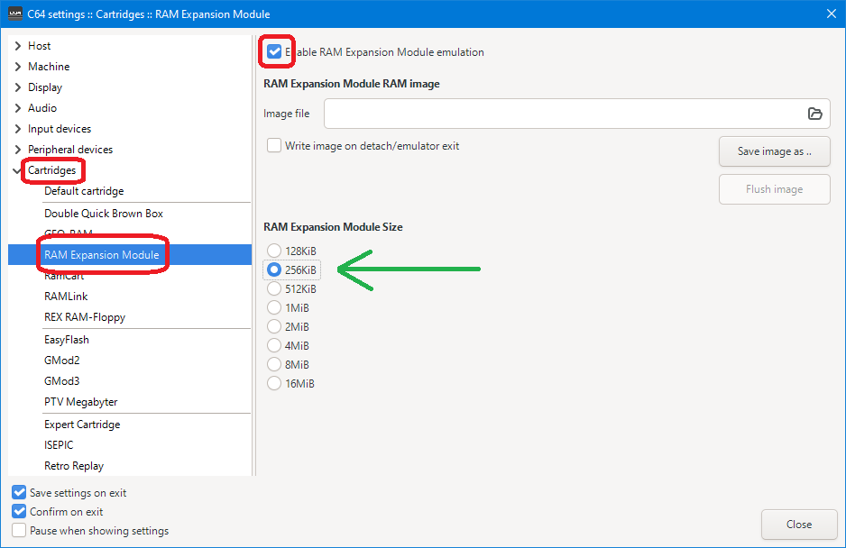

On Kung Fu Flash we have to be sure to end up in a mode where the REU is enabled.
See [KimJorgensen repo](https://codeberg.org/KimJorgensen/KungFuFlash2#reu-emulation).


### Presence

I struggled with enabling my REU on the Kung Fu Flash 2.
I wrote several tests to check if the REU is present (active).
I have combined all tests in one program: `01-presence`.

```basic
100 rem reu presence tester
110 rem mc pennings, 2026 may 3
120 print"{clr}{down}{wht}testing presence of reu{lblu}"
130 r=57088:f=0:rem reu addrs,num fails
140 :
150 :
200 print "{down}test 1 reu datalines float"
210 v=peek(r):print " status: peek";v;
220 if v=255 then print "floats:maybe no reu":f=f+1:goto 300
230 print "not floating:maybe reu"
290 :
295 :
300 print "{down}test 2 set endofblock-mask"
310 poke r+9,64:v=peek(r+9)and224
320 print " mask: poke 64 peek";v;
330 if v<>64 then print "unequal:no reu":f=f+1:goto 400
340 print "equal:maybe reu"
390 :
395 :
400 print "{down}test 3 set fault-mask"
410 poke r+9,32:v=peek(r+9)and224
420 print " mask: poke 32 peek";v;
430 if v<>32 then print "unequal:no reu":f=f+1:goto 500
440 print "equal:maybe reu"
490 :
495 :
500 print "{down}test 4 clr endofblock-mask"
510 v=peek(r)and224:rem read clears
520 print " status: peek";v;"(clr) ";
530 if v<>0 then print "unequal:no reu":f=f+1:goto 600
540 print "equal:maybe reu"
590 :
595 :
600 print "{down}test 5 transfer"
610 poke r+2,0:poke r+3,192:rem $c000
620 poke r+4,0:poke r+5,0:poke r+6,0
630 poke r+7,5:poke r+8,0:rem len=$0005
640 poke r+9,0:rem int mask
650 poke r+10,0:rem inc both addrs
660 poke r+1,128+16:rem ex+noff00+stash
670 v=peek(r):print " status: peek";v;
680 if (v and 64)<>64 then print "eob not set:no reu":f=f+1:goto 700
690 print "eob set:maybe reu"
695 :
697 :
700 print "{down}test report (";f;"fails )"
710 if f=0 then print" all tests pass"
720 if f<>0then print" some tests fail"
730 if f=0 then print" reu {wht}present{lblu}"
740 if f<>0then print" reu {wht}absent{lblu}"
```

- Test 1 (line 200) reads the memory location where the REU is expected (`R` or 57088).
  If there is no device, typically the data line are floating and the 6510 reads 255.
  
- Test 2 (line 300) goes a step further and performs a write and read back of the REU register `irqmask`.
  The test writes 64 and reads that back. Of course there might be a non-REU device 
  that happens to read 64 at address `R+9`. Hence test 3.
  
- Test 3 (line 400) is the same as test 2, but now writes 32.
  This establishes that `R+9` is a register that can be written and read back.
  Could still be another device than REU.
  
- Test 4 (line 500) is a preparation step for test 5. It reads the REU and assumes the 
  END-OF-BLOCK is clear - since no transfer has taken place.
  A read will also clear it, for test 5.
  
- Test 5 (line 600) is a full transfer command from C000 to 000000 of 5 bytes.
  This should set the END-OF-BLOCK in `status`.
  The chance that another device then a REU has this action-result behavior is small.

- Line 700 presents the conclusion.
  
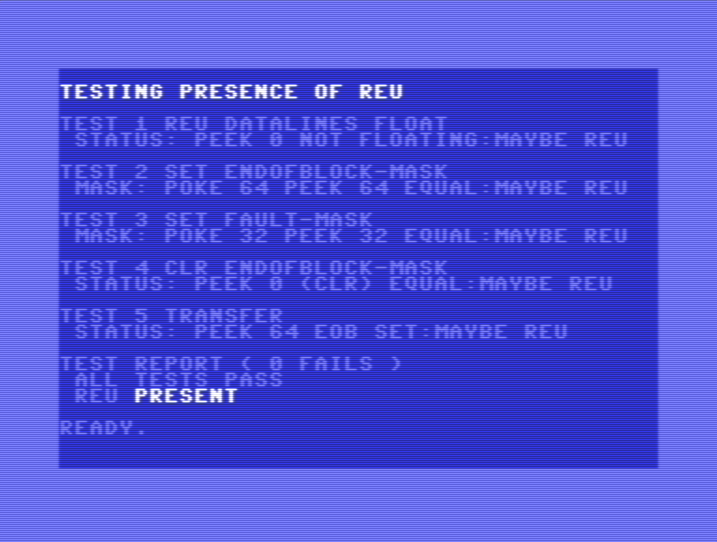


### Size

The `status` register has one bit indicating size.
If `status.SIZE` is 0 the REU is 128 kbyte, otherwise it is larger.
Program `02-size` gives more specific numbers (for larger REUs).

I struggled, again, to determine REU size.
The problem is that a write to an address beyond the size of the REU is successful; 
the written value can even be read back. The reason for this is that the REU 
"wraps around" for high addresses. For example, if the REU contains 4 blocks of 
64 kbyte, a write to block 4 ends up in block 0, a write to 5 ends up in 1, 6 in 2,
and 7 in 3. This continues: a write to block 8 also wraps to block 0.

I solved the problem of determining the size by doing a single byte write 
to the highest address of every block. The value I write is the _block number itself_.
In other words, I write 00 to 00FFFF, 01 to 01FFFF, 02 to 02FFFF and so, up to FF to FFFFFF.
This takes 256 transfers which can be done in reasonable time. 
The second part of the solution is to write these values in _reverse order_:
starting with block FF, then FE, down to 00. The effect of this is that
(the highest byte of) the lower blocks contain their block number.
The higher blocks also write their block number, but these get overridden 
by the writes of the lower blocks. This means that only blocks backed by 
hardware are not overwritten.

Below table shows the content of (the highest byte of) the REU blocks.
It assumes a REU with 4 blocks (columns 0, 1, 2, and 3), but also shows the 
aliased blocks (4, 5, 6, 7 which could have been extended to 255).
All aliased blocks are enclosed in parenthesis.
The first row shows the testing process at step 248, when blocks 255 down to 8 have been written.
The next rows show the 8 final steps (changes in bold), until the last block, block 0, is written.

  | time (action) \ block |   0   |   1   |   2   |   3   |  (4)  |  (5)  |  (6)  |  (7)  | ... | 
  |:----------------------|:-----:|:-----:|:-----:|:-----:|:-----:|:-----:|:-----:|:-----:|:---:|
  | time=248: stash 8     | **8** |   9   |  10   |  11   |**(8)**|  (9)  | (10)  | (11)  | ... |
  | time=249: stash 7     |   8   |   9   |  10   | **7** |  (8)  |  (9)  | (10)  |**(7)**| ... |
  | time=250: stash 6     |   8   |   9   | **6** |   7   |  (8)  |  (9)  |**(6)**|  (7)  | ... |
  | time=251: stash 5     |   8   | **5** |   6   |   7   |  (8)  |**(5)**|  (6)  |  (7)  | ... |
  | time=252: stash 4     | **4** |   5   |   6   |   7   |**(4)**|  (5)  |  (6)  |  (7)  | ... |
  | time=253: stash 3     |   4   |   5   |   6   | **3** |  (4)  |  (5)  |  (6)  |**(3)**| ... |
  | time=254: stash 2     |   4   |   5   | **2** |   3   |  (4)  |  (5)  |**(2)**|  (3)  | ... |
  | time=255: stash 1     |   4   | **1** |   2   |   3   |  (4)  |**(1)**|  (2)  |  (3)  | ... |
  | time=256: stash 0     | **0** |   1   |   2   |   3   |**(0)**|  (1)  |  (2)  |  (3)  | ... |

At the end, blocks 0, 1, 2 and 3 have the correct value (their block number), but block 4 is wrong.
It should have 4 but contains 0. Blocks 0 to 3 are fine, 4 is not, so the REU size is 4 blocks.

Notes on the program:

- `CS` has the LOAD flag set (line 140). 
  This means the `c64base`, `reubase` and `translen` 
  are restored after each transfer, which allows us 
  to only poke `R+6` in each loop.
- Both loops (of 256 iterations) print a progress bar with `:` 
  every 8 (see `P`) iterations.
- The second loop aborts as soon as the REU memory ends (line 440).
- On line 430 we "clear" the C64base location with `255-B`;
  we expect to read `B`.

```basic
100 rem reu size tester
110 rem mc pennings 2026 may 3
120 print "reu size tester"
130 r=57088:a=49152:rem r=reu,a=c64base
140 cs=128+32+16:rem ex+ld+noff00+stash
150 cf=cs+1:rem fetch
160 :
200 rem prep reu
210 poke r+2,0:poke r+3,192:rem c000=a
220 poke r+4,255:poker+5,255:rem r+6
230 poke r+7,1:poke r+8,0:rem len=0001
240 poke r+9,0:rem int mask
250 poke r+10,0:rem inc both addrs
260 :
300 rem writing 256 blocks
310 print "stash :";:p=8
320 for b=255 to 0 step -1
330 :pokea,b:poker+6,b:poker+1,cs
340 :p=p-1:if p=0 then p=8:print":";
350 next:print
360 :
400 rem reading and checking blocks
410 print "fetch :";:p=8
420 for b=0 to 255
430 :pokea,255-b:poker+6,b:poker+1,cf
440 :if peek(a)<>b then print:goto 500
450 :p=p-1:if p=0 then p=8:print":";
460 next:print
470 :
500 rem report size
510 b1$=mid$(str$(b),2)
520 b2$=mid$(str$(b*64),2)
530 b3$=mid$(str$(b/16),2)
540 print "reu "b1$"*64k "b2$"k "b3$"m"
```

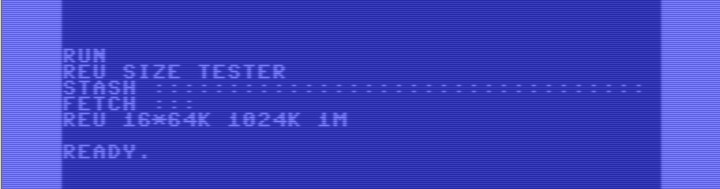


### Stash, fetch, swap

Let's now have the **main example**, using the REU for stash, fetch and swap.
This is program `03-stash-fetch-swap` on the virtual disk.

```basic
100 rem reu stash fetch swap
110 rem mc pennings 2026 may 4
120 print "reu stash fetch swap"
130 r=57088:a=49152:rem r=reu,a=c64base
160 :
200 for i=0 to 7:poke a+i,i:next
210 print "filled 0-7":gosub999
220 :
300 poke r+2,0:poke r+3,192:rem c000=a
310 poke r+4,0:poke r+5,0:poke r+6,0
320 poke r+7,8:poke r+8,0:rem len=0008
330 poke r+9,0:rem int mask
340 poke r+10,0:rem inc both addrs
350 poke r+1,144:print "stash":gosub999
360 :
400 for i=0 to 7:poke a+i,8-i:next
410 print "filled 8-1":gosub999
420 :
500 poke r+2,0:poke r+3,192:rem c000=a
510 poke r+4,0:poke r+5,0:poke r+6,0
520 poke r+7,8:poke r+8,0:rem len=0008
530 poke r+9,0:rem int mask
540 poke r+10,0:rem inc both addrs
550 poke r+1,145:print "fetch":gosub999
560 :
600 for i=0 to 7:poke a+i,8-i:next
610 print "filled 8-1":gosub999
620 :
700 poke r+2,0:poke r+3,192:rem c000=a
710 poke r+4,0:poke r+5,0:poke r+6,0
720 poke r+7,8:poke r+8,0:rem len=0008
730 poke r+9,0:rem int mask
740 poke r+10,0:rem inc both addrs
750 poke r+1,146:print "swap ":gosub999
760 :
800 poke r+2,0:poke r+3,192:rem c000=a
810 poke r+4,0:poke r+5,0:poke r+6,0
820 poke r+7,8:poke r+8,0:rem len=0008
830 poke r+9,0:rem int mask
840 poke r+10,0:rem inc both addrs
850 poke r+1,146:print "swap ":gosub999
860 :
900 print "status";peek(r)and224
910 print "status";peek(r)and224
998 end
999 print " c000:";:for i=0 to 7:print str$(peek(a+i));:next:print:return
```

The program uses an 8-byte memory buffer at 49152/C000 and transfers that to the REU (address 000000).
It goes through these phases

- Lines 200-220 fill the memory buffer with the values 0 to 7 and prints the buffer (0-7).
- Lines 300-360 stash the memory buffer to the REU, and prints the (unmodified) buffer (0-7).
- Lines 400-420 fill the memory buffer with the values 8 to 1 and prints the buffer (8-1).
- Lines 500-560 fetch 8 bytes from the REU into the memory buffer, and prints the (fetched) buffer (0-7).
- Lines 600-620 fill the memory buffer again with the values 8 to 1 and prints the buffer (8-1).
- Lines 700-760 swap 8 bytes from the REU with 8 bytes from the memory buffer, and prints the buffer (0-7).
- Lines 800-860 swap again 8 bytes from the REU with 8 bytes from the memory buffer, and prints the buffer (8-1).
- line 900 shows that the `status` register has the END OF BLOCK set.
- line 910 shows that the `status` register was cleared by the previous read.

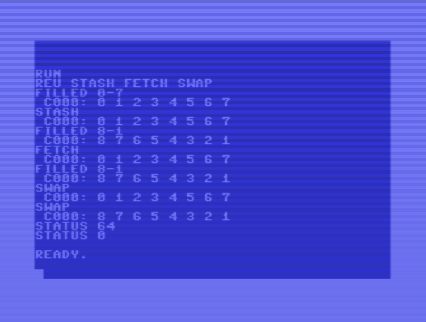


### Compare

The previous example skipped one transfer, the "compare".
Program `04-compare` is the topic of this section.

```basic
100 rem reu compare
110 rem mc pennings 2026 may 4
120 print "reu compare"
130 r=57088:a=49152:rem r=reu,a=c64base
160 :
200 for i=0 to 7:poke a+i,i:next
210 print "filled 0-7":gosub999
220 :
300 poke r+2,0:poke r+3,192:rem c000=a
310 poke r+4,0:poke r+5,0:poke r+6,0
320 poke r+7,8:poke r+8,0:rem len=0008
330 poke r+9,0:rem int mask
340 poke r+10,0:rem inc both addrs
350 poke r+1,144:print "stash":gosub999
360 :
400 for i=0 to 7:poke a+i,i:next
410 poke a+4,100
420 print "filled 0-7 +change":gosub999
430 :
500 poke r+2,0:poke r+3,192:rem c000=a
510 poke r+4,0:poke r+5,0:poke r+6,0
520 poke r+7,8:poke r+8,0:rem len=0008
530 poke r+9,0:rem int mask
540 poke r+10,0:rem inc both addrs
550 poke r+1,147:print "comp "
560 :
600 print "stat"peek(r)and224
610 print "stat"peek(r)and224
620 print "c64 "peek(r+2)+256*peek(r+3)
630 print "reu "peek(r+4)+256*peek(r+5)
640 print "len "peek(r+7)+256*peek(r+8)
650 :
998 end
999 print " c000:";:for i=0 to 7:print str$(peek(a+i));:next:print:return
```

Also this program uses an 8-byte memory buffer at 49152/C000 and 
transfers to the REU (address 000000) and then compares it.

- Lines 200-220 fill the memory buffer with the values 0 to 7 and prints the buffer (0-7).
- Lines 300-360 stash the memory buffer to the REU, and prints the (unmodified) buffer (0-7).
- Lines 400-420 fill the memory buffer with the values 0 to 7 but changes item 4 to 100, then prints the buffer (0-7).
- Lines 500-560 compares the buffer with the REU.
- Lines 600 prints the status, the FAULT is flagged.
- Lines 610 prints the status again to show that the previous read cleared the flag.
- Lines 620-640 print the addresses and length register. 
  Observe that they retained the value they had when the REU detected the FAULT (difference).
  That value is, strangely enough one after where the FAULT was.
  Observe also that the length is decreasing, so it shows the _remaining_ number of bytes to compare.

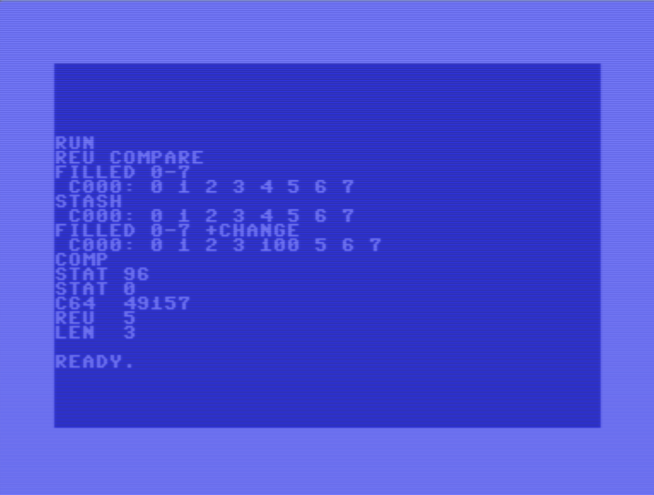


### Load bit

As we saw with the [Compare example](#compare), the address registers are incremented
every time a byte is transferred, and the length is decremented. If the LOAD flag 
in the `command` register is set the registered are restored to their initial value 
once the transfer is complete. This is useful if the similar addresses and sizes are 
needed in consecutive transfers. This was actually used in the [Size example](#size).

Program `05-loadbit` tests the LOAD bit exclusively.

```basic
100 rem reu load bit
110 rem mc pennings 2026 may 4
120 print "reu load bit"
130 r=57088:a=49152:rem r=reu,a=c64base
160 :
200 for i=0 to 7:poke a+i,i:next
210 print "filled 0-7":gosub999
220 :
300 poke r+2,0:poke r+3,192:rem c000=a
310 poke r+4,0:poke r+5,0:poke r+6,0
320 poke r+7,8:poke r+8,0:rem len=0008
330 poke r+9,0:rem int mask
340 poke r+10,0:rem inc both addrs
350 rem command=ex+noff00+fetch
360 poke r+1,128+16+1
370 print "fetch (load=0)":gosub999
380 :
400 print " c64"peek(r+2)+256*peek(r+3)
410 print " reu"peek(r+4)+256*peek(r+5)
420 print " len"peek(r+7)+256*peek(r+8)
430 :
500 poke r+2,0:poke r+3,192:rem c000=a
510 poke r+4,0:poke r+5,0:poke r+6,0
520 poke r+7,8:poke r+8,0:rem len=0008
530 poke r+9,0:rem int mask
540 poke r+10,0:rem inc both addrs
550 rem command=ex+load+noff00+fetch
560 poke r+1,128+32+16+1
570 print "fetch (load=1)":gosub999
580 :
600 print " c64"peek(r+2)+256*peek(r+3)
610 print " reu"peek(r+4)+256*peek(r+5)
620 print " len"peek(r+7)+256*peek(r+8)
630 :
998 end
999 print " c000:";:for i=0 to 7:print str$(peek(a+i));:next:print:return
```

- Lines 200-220 fill the memory buffer with the values 0 to 7 and prints the buffer (0-7).
- Lines 300-380 fetches the memory buffer. Pay attention to lines 350/360: the fetch command does _not_ have LOAD flag set.
- Lines 400-430 print the addresses and length. Note that the code cheats for the REU address.
  It prints `peek(r+4)+256*peek(r+5)` but this should have been `peek(r+4)+256*peek(r+5)+256*256*peek(r+6)`.
  The problem is that on my machine the highest byte is unreliable - are the MSB floating?
- Lines 500-580 fetches the memory buffer again. Pay attention to lines 550/560: the fetch command _does_ have LOAD flag set.
- Lines 600-630 print the addresses and length again.

Observe that in the first fetch (LOAD clear) the addresses point to the end of the buffers and length is 1,
whereas in the second fetch the addresses point to the start again, and length is also set back to 8.

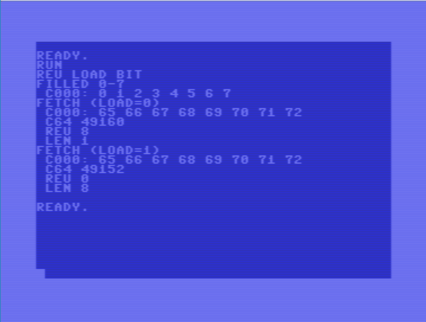

You might wonder about the buffer values that are printed in the screenshot.
Lines 200-220 fill the C64 with values 0 to 7. But there is no stash command.
On lines 300-380 a fetch is followed by a print of the buffer which now shows 65-72.

Normally, the REU memory would be undefined, so what is fetched would be "chaotic".
However, I made the screenshot on VICE, and VICE allows one to control the REU memory. 

I created an empty image file. In Preferences > Settings > Cartridges > RAM Expansion Module,
I first entered a non existing file (`C:\Users\maarten\Desktop\reuimage.bin`) and then 
placed a check mark in  `Enable RAM Expansion Module emulation`. This created a file 
with "chaotic" contents.

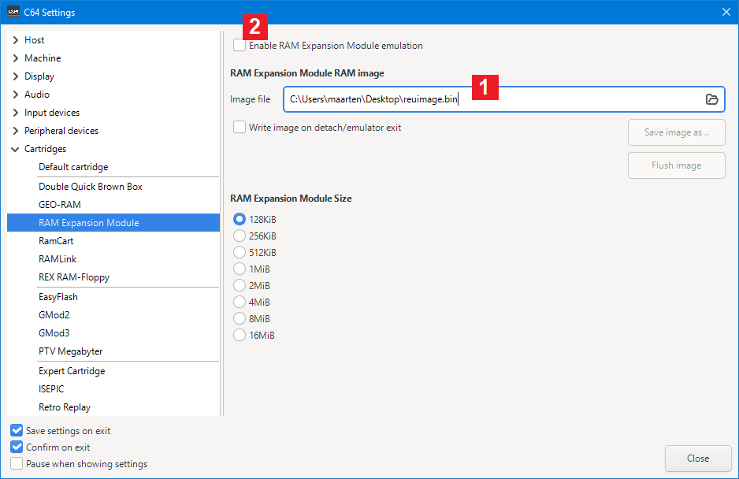

Next I opened the file in an editor deleted 8 characters and entered 8 letters (A-H).
I did it in a plain text editor; it would be wiser to use an editor in hex mode.

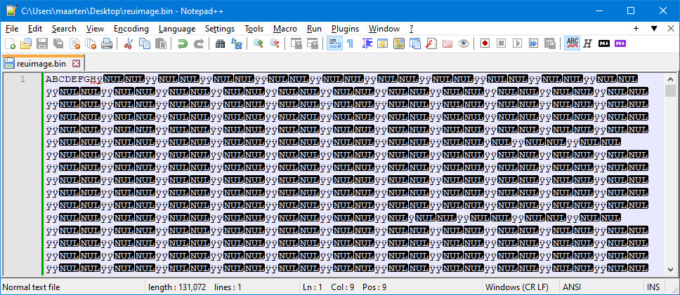

Finally I unchecked and rechecked `Enable RAM Expansion Module emulation` to force a reload.
Then I ran the BASIC program.


### NOFF00 bit

The `command` register has a second flag next to LOAD, the flag with the funny name NOFF00.
When cleared, execute waits till there is a write to address $FF00.

This is tested by program `06-noff00bit`.

```basic
100 rem reu noff00 bit
110 rem mc pennings 2026 may 4
120 print "reu noff00 bit"
130 r=57088:a=49152:rem r=reu,a=c64base
160 :
200 for i=0 to 7:poke a+i,i:next
210 print "filled 0-7":gosub999
220 :
300 poke r+2,0:poke r+3,192:rem c000=a
310 poke r+4,0:poke r+5,0:poke r+6,0
320 poke r+7,8:poke r+8,0:rem len=0008
330 poke r+9,0:rem int mask
340 poke r+10,0:rem inc both addrs
350 rem command=ex+noff00+stash
360 poke r+1,128+16+0
370 print "stash ":gosub999
380 :
400 for i=0 to 7:poke a+i,8-i:next
410 print "filled 8-1":gosub999
420 :
500 poke r+2,0:poke r+3,192:rem c000=a
510 poke r+4,0:poke r+5,0:poke r+6,0
520 poke r+7,8:poke r+8,0:rem len=0008
530 poke r+9,0:rem int mask
540 poke r+10,0:rem inc both addrs
550 rem command=ex+fetch
560 poke r+1,128+1
570 print "fetch (noff00=0)":gosub999
580 :
600 i=peek(255*256)
610 print "peek(ff00)":gosub999
620 poke 255*256,i
630 print "poke ff00":gosub999
640 :
998 end
999 print " c000:";:for i=0 to 7:print str$(peek(a+i));:next:print:return
```

- Lines 200-220 fill the memory buffer with the values 0 to 7 and prints the buffer (0-7).
- Lines 300-380 stash the memory buffer to the REU, and prints the (unmodified) buffer (0-7).
- Lines 400-420 fill the memory buffer with the values 8 to 1, then prints the buffer (8-1).
- Lines 500-580 fetch the memory buffer from the REU. The NOFF00 flag is clear (see lines 550 and 560) so the transfer is not executed. When the buffer prints we see the (unmodified) buffer (8-1).
- Lines 600 accesses FF00 with a read; line 610 prints the buffer and we see the still (unmodified) buffer (8-1). A read of FF00 is not enough.
- Lines 620 writes FF00 and line 620 prints the fetched buffer (0-7).

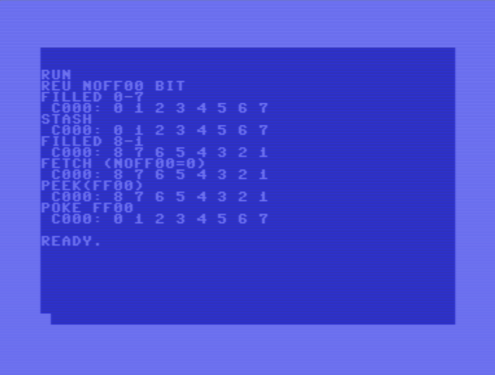


### Continuous REU memory

As stated previously, some documents call the byte at offset 6 a "bank", 
with offset 4 and 5 denoting the offset within that 64 kbyte bank.
However, the REU has a _continuous_ memory from 0x00 0000 to 0xFF FFFF (assuming a 1M byte REU).

Example `07-contmem` on the disk shows that.

```basic
100 rem reu contmem
110 rem mc pennings 2026 may 4
120 print "reu contmem"
130 r=57088:a=49152:rem r=reu,a=c64base
160 :
200 for i=0 to 7:poke a+i,i:next
210 print "filled 0-7":gosub999
220 :
300 poke r+2,0:poke r+3,192:rem c000=a
310 poke r+4,250:poke r+5,255:poker+6,0
310 poke r+4,250:poke r+5,255:poker+6,0
320 poke r+7,8:poke r+8,0:rem len=0008
330 poke r+9,0:rem int mask
340 poke r+10,0:rem inc both addrs
350 rem command=ex+noff00+stash
360 poke r+1,128+16+0
370 print "stash":gosub999
380 :
400 for i=0 to 7:poke a+i,8-i:next
410 print "filled 8-1":gosub999
420 :
500 poke r+2,0:poke r+3,192:rem c000=a
510 poke r+4,250:poke r+5,255:poker+6,0
520 poke r+7,8:poke r+8,0:rem len=0008
530 poke r+9,0:rem int mask
540 poke r+10,0:rem inc both addrs
550 rem command=ex+noff00+fetch
560 poke r+1,128+16+1
570 print "fetch":gosub999
580 :
998 end
999 print " c000:";:for i=0 to 7:print str$(peek(a+i));:next:print:return
```

The key change is in lines 310 and 510.
The 8-byte C64 buffer is transferred to and from REU range 00 FFFA - 01 0001, 
without problems crossing a 64 kbyte boundary.

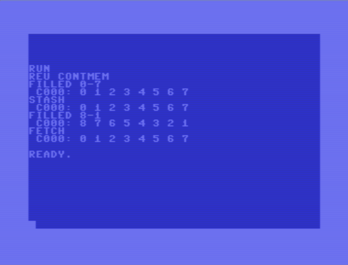


### Fill

The `addrctrl` register has two flags. 
When `C64BASEFIX` is set, the `c64base` address is not incremented every byte of the transfer.
When `REUBASEFIX` is set, the `reubase` address is not incremented every byte of the transfer.
In other words, when these bits are set, the REU transfer acts as a _memory fill_.

Example `08-fill` tests this feature; it fills the C64 memory.

```basic
100 rem reu contmem
110 rem mc pennings 2026 may 4
120 print "reu fill"
130 r=57088:a=49152:rem r=reu,a=c64base
160 :
200 for i=0 to 7:poke a+i,i:next
210 print "filled 0-7":gosub999
220 :
300 poke r+2,0:poke r+3,192:rem c000=a
310 poke r+4,0:poke r+5,0:poke r+6,0
320 poke r+7,8:poke r+8,0:rem len=0008
330 poke r+9,0:rem int mask
340 poke r+10,0:rem inc both addrs
350 rem command=ex+load+noff00+stash
360 poke r+1,128+32+16+0
370 print "stash":gosub999
380 :
400 poke r+2,0:poke r+3,192:rem c000=a
410 poke r+4,2:poke r+5,0:poke r+6,0
420 poke r+7,8:poke r+8,0:rem len=0008
430 poke r+9,0:rem int mask
440 poke r+10,64:rem fix reu addrs
450 rem command=ex+load+noff00+fetch
460 poke r+1,128+32+16+1
470 print "fetch (reu fixed)":gosub999
480 :
998 end
999 print " c000:";:for i=0 to 7:print str$(peek(a+i));:next:print:return
```

- Lines 200-220 fill the memory buffer with the values 0 to 7 and prints the buffer (0-7).
- Lines 300-380 stash the memory buffer to the REU, and prints the (unmodified) buffer (0-7).
- Lines 400-480 fetch the memory buffer from the REU. 
The REUBASEFIX flag is clear (see lines 440) so the REU address stays fixed at 000002 (see line 410).
At the address the value 02 was just stashed, so this is now fetched 8 times in the C64 buffer. 
When the buffer prints we see that (2-2).


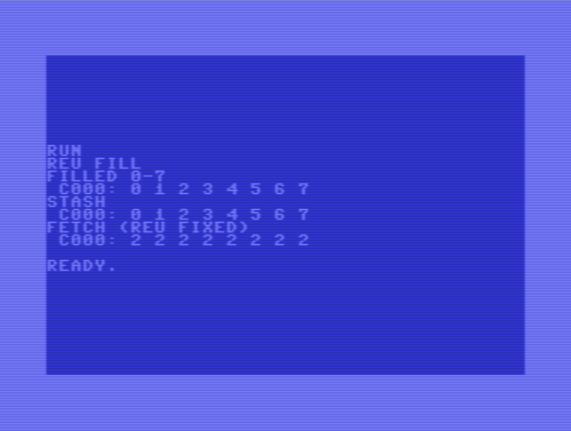


### To do

- Test `translen` of 0 being 64 kbyte.
- What happens when transferring `len` bytes from/to C64 address `ad`, when `ad+len > $FFFF`.
- What happens when transferring `len` bytes from/to reu address `ad`, when `ad+len > $FFFFFF`.
- Try IRQ example.


## Links

REU specific

- [Codebase64 REU programming](https://www.codebase64.net/doku.php?id=base:reu_programming)
- [Same article on Zimmers](http://www.zimmers.net/anonftp/pub/cbm/documents/chipdata/programming.reu)
- [REU registers on Zimmers](http://www.zimmers.net/anonftp/pub/cbm/documents/chipdata/reu.registers)

- [C64-wiki REU](https://www.c64-wiki.com/wiki/REU)
- [C64-wiki Commodore REU](https://www.c64-wiki.com/wiki/Commodore_REU)
          
- [Ruud Baltissen E-REU](http://www.baltissen.org/newhtm/e_reu.htm)
- [REU programming by Robin Harbron](https://psw.ca/robin/?page_id=182)

General

- [BASIC control characters](https://www.c64-wiki.com/wiki/control_character)
- [Kung Fu Flash 2](https://codeberg.org/KimJorgensen/KungFuFlash2)
- [Commodore 64 Ultimate](https://commodore.net)

(end)
