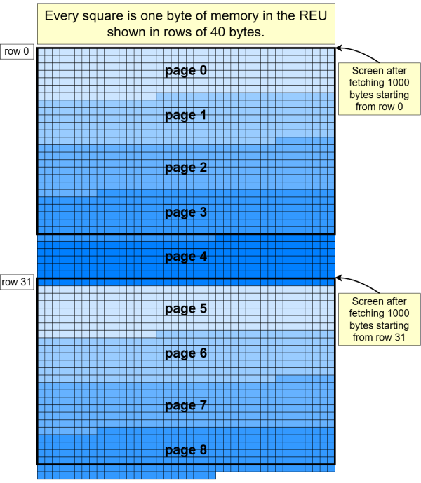
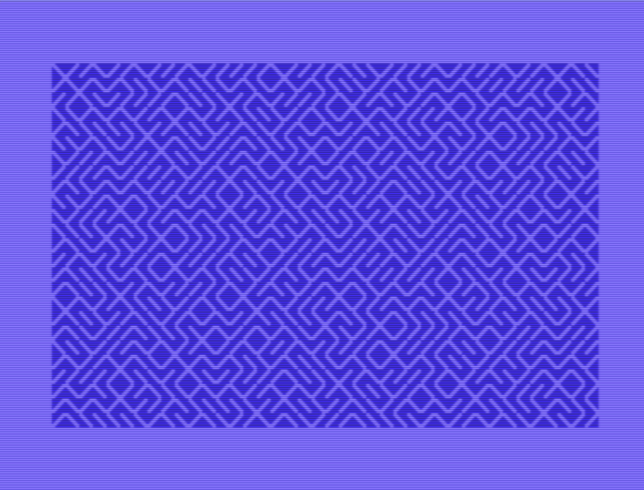

[](https://github.com/maarten-pennings/C64howto/tree/main/MCC)

Maarten Pennings MCC#03 


# REU in BASIC

Dit artikel is een verkorte Nederlandse versie van een Engels artikel.
Dat bevat meer details en bijvoorbeeld ook source files.

> [https://github.com/maarten-pennings/C64howto/blob/main/reu/readme.md](https://github.com/maarten-pennings/C64howto/blob/main/reu/readme.md). 


## Introductie

In 1985 heeft Commodore de eerste REU (**R**AM **E**xpansion **U**nit) op de markt 
gebracht. Een REU breidt het geheugen van de Commodore 64 behoorlijk uit, met 
128 kB (REU 1700), 256 kB (REU 1764), of zelfs 512 kB (REU 1750).
Ook moderne systemen zoals VICE, de Commodore Ultimate, The C64, en Kung Fu Flash 2
hebben ondersteuning voor een REU. In dit artikel bekijken we hoe een REU werkt,
en we schrijven een BASIC programma ("10 PRINT") dat de REU gebruikt.

Een REU gebruikt geen _banking_ mechanisme. We spreken van banking wanneer er 
meerdere RAM chips op hetzelfde adres gebied zitten, en er een mechanisme is 
om te kiezen welke chip (welke _bank_) op enig moment actief is. Bij een banking 
oplossing kiest de CPU, in ons geval de 6510, welke bank actief is, en 
daarna kan de CPU de bank lezen en schrijven.

De REU werkt anders. Een REU is een memory mapped I/O device. Het wordt bediend
met zeven registers. Via deze registers geeft de 6510 commando's (met `POKE`s) 
om data uit het C64 geheugen ergens in het REU geheugen te _stashen_, of om 
data uit het REU geheugen te _fetchen_ en ergens in het C64 geheugen te plaatsen.
Er zijn nog twee andere commando's: _swap_ en _compare_ maar die zullen we in 
dit artikel niet bekijken. We gebruiken de term kopiëren als overkoepelend 
begrip voor alle 4 de commando's.

De 6510 kan dus _niet_ het geheugen van de REU lezen of schrijven. Het kan 
alleen een kopieer opdracht aan de REU geven. De REU is dus een soort DMA device
(_direct memory access_) dat data kopieert tussen de REU en de C64. Dat klinkt 
langzaam, en ten opzichte van _bank switching_ is het dat ook. _Bank switching_ 
kost een of twee 6510 instructies. Maar in de praktijk is het snel. De REU 
kopieert op volle C64 klok snelheid: elke tik van de ongeveer 1MHz klok wordt 
1 byte gekopieerd. Dat betekent dat 1 miljoen bytes in 1 seconde worden 
gekopieerd, ofwel 1000 bytes in 1 ms. Het hele C64 geheugen kopiëren kost 
dus 64 ms.


## Registers

De REU registers zijn _memory mapped_ in de "I/O 2" regio; die begint op $DF00.
De REU heeft 7 registers variërend in grootte van 1 tot 3 bytes.

  | Register   | Size | Offset | Hex       | Dec         |
  |:----------:|:----:|:-------|:----------|:------------|
  | `status`   |   1  |  0     | DF00      | 57088       |
  | `command`  |   1  |  1     | DF01      | 57089       |
  | `c64base`  |   2  |  2,3   | DF02-DF03 | 57090-57091 |
  | `reubase`  |   3  |  4,5,6 | DF04-DF06 | 57092-57094 |
  | `translen` |   2  |  7,8   | DF07-DF08 | 57095-57096 |
  | `irqmask`  |   1  |  9     | DF09      | 57097       |
  | `addrctrl` |   1  |  10    | DF0A      | 57098       |

Het `status` register is eigenlijk niet belangrijk. Het geeft aan of de REU 
al klaar is met het uitvoeren van het kopieer commando (via bit 6). In de 
praktijk blokkeert (_stalls_) de REU de 6510 tijdens het kopiëren. 
Als de 6510 dus weer begint te lopen is het niet nodig het `status` register 
te bekijken; de REU is klaar.

We slaan `command` even over en springen naar registers `c64base`, `reubase`, 
en `translen`. Het register `c64base` is het start adres van de kopieer actie 
aan de C64 kant, het register `reubase` is het start adres van de kopieer actie 
aan de REU kant, en `translen` is het aantal te kopiëren bytes. Merk op dat 
`c64base` (en `translen`) beide 2 bytes zijn en dus de hele 64 kB van de 6510 
omvat, terwijl `reubase` zelfs 3 bytes is, zodat het REU geheugen maximaal 
256 × 64 kB kan zijn (16777216 bytes of 16 Mbytes).

  | Bits | Function     | Details `command`                                                   |
  |:----:|:------------:|:--------------------------------------------------------------------|
  |   7  | EXECUTE      | 1 start een kopieer actie (van type TRANSFERTYPE)                   |
  |   6  |              |                                                                     |
  |   5  | LOAD         | 1 = `c64base`, `reubase`, `translen` zet start waardes terug        |
  |   4  | NOFF00       | 1 = start meteen, 0 = start na schrijven naar $FF00                 |
  |  3:2 |              |                                                                     |
  |  1:0 | TRANSFERTYPE | 00=_stash_ (C64→REU), 01=_fetch_ (REU→C64), 10=_swap_, 11=_compare_ |

Het `command` register bestuurt de kopieer actie. De onderste twee bits 
`TRANSFERTYPE` bepalen welk van de 4 kopieer acties wordt uitgevoerd. 
Het `EXECUTE` bit (bit 7: 128) start de actie. Tijdens de kopieer actie zal 
de REU de registers `c64base`, `reubase` stap voor stap ophogen en `translen` 
aflagen. Als `LOAD` (bit 5: 32) hoog is zal de REU de startwaardes herstellen 
aan het einde van de kopie. De vlag `NOFF00` stelt je in staat de start nog 
even uit te stellen; die begint pas na een schrijfactie naar $FF00. Dit is 
nodig in één speciaal geval: als de REU het C64 geheugen moet lezen of schrijven,
dat _onder_ het I/O 2 gebied ligt. 

Het `irqmask` register geeft de mogelijkheid een interrupt te genereren als 
de kopieer actie klaar is. Zoals bij `status` vermeld _stallt_ de REU de 6510
tot het kopiëren klaar is dus interrupts zijn niet nodig.

Het laatste register `addrctrl` bepaalt of de registers `c64base` en `reubase` 
tijdens de kopieer actie opgehoogd worden of niet. Bit 7 (128) is voor `c64base` 
en bit 6 (64) voor `reubase`. Niet ophogen is zinvol als er een _memory fill_ 
nodig is: steeds hetzelfde byte schrijven naar alle adressen in het doel 
geheugen.

Zie het Engelse artikel op GitHub voor meer details en BASIC voorbeelden 
voor alle registers.


## 10 PRINT met REU 

Nu we weten hoe de REU werkt gaan we hem gebruiken in een BASIC programma.
We gaan het klassieke 10 PRINT programma nabouwen. 10 PRINT omdat iedereen 
het kent en omdat het goed past bij de mogelijkheden van de REU.


### 10 PRINT

Het klassieke 10 PRINT programma bestaat uit één regel:

```basic
  10 PRINT CHR$(205.5+RND(1));:GOTO 10
```
  
Het gebruikt de `RND(1)` functie om een willekeurig getal tussen 0 en 1 te 
genereren. Hierdoor ligt `205.5+RND(1)` tussen 205.5 en 206.5. De `CHR$()` 
functie kapt het argument af naar 205 of 206, waardoor een `\` of `/` streep 
wordt afgedrukt. De GOTO 10 vormt een lus, wat leidt tot het afdrukken van 
oneindig veel schuine strepen, zodat er een doolhof patroon ontstaat.


### REU en 10 PRINT

De REU kan snel 1000 tekens kopiëren van zijn geheugen naar het C64-geheugen.
We zullen de REU opdracht geven te kopiëren naar $0400, het scherm geheugen 
van de C64. Zoals we eerder zagen, de REU kopieert 1000 tekens, één scherm, 
in 1 ms.

Het idee is dat we veel schuine strepen van het 10 PRINT-programma opslaan 
in het REU-geheugen. We slaan ze op vanaf adres 0 ($000000) in de REU. 

Voor de animatie halen we 1000 bytes op vanaf REU adres 0 en plaatsen deze 
op C64 adres $0400 (het scherm). Daarna halen we 1000 bytes op vanaf REU adres 
40 en plaatsen die opnieuw op $0400. Dit scrolt het scherm één rij omhoog. 
Vervolgens halen we 1000 bytes op vanaf REU adres 80 en plaatsen die op $0400; 
weer _scrollt_ het scherm een rij omhoog. En zo verder. 

Dit gaat snel. Het is niet meer nodig om strepen te berekenen en ook de 
_kernel-scroll_ routine hoeft niet meer aangeroepen te worden. 
Elke kopie duurt slechts 1 ms (we hebben nog wel een paar BASIC `POKE` 
opdrachten nodig om de kopie te starten).


### REU geheugen indeling

Er zijn twee problemen met de hierboven geschetste REU versie van 10 PRINT.

Het eerste probleem is dat elke schuine streep, in de REU moet staan; 
we moeten ze dus toch allemaal berekenen. Om dit op te lossen, spelen we 
een beetje vals. We genereren slechts 256 schuine strepen en slaan meerder 
kopieën van dit setje achtereenvolgens op in het REU geheugen. 
Als je goed kijkt kun je dat zien, maar 256 schuine strepen is 6 scherm 
rijen (van 40) plus nog 16 tekens. Hierdoor is de tweede reeks van 256 
schuine strepen met 16 tekens verschoven. Dit maakt het lastiger om het 
herhalende patroon te zien. Goed genoeg voor onze eenvoudige demo. 
Vanaf nu noemen we een reeks van 256 schuine strepen één pagina.

Het tweede probleem is dat we willen dat de animatie oneindig door loopt, 
net als in het originele 10 PRINT programma. Het is duidelijk dat we geen 
oneindige hoeveelheid (identieke) pagina's van 256 schuine strepen in 
het REU geheugen kunnen hebben. Hier schiet de wiskunde ons te hulp. 
Het kleinste gemene veelvoud van de rijgrootte 40 en de paginagrootte 256 
is 1280. We kunnen precies 5 pagina's (van 256 tekens) kwijt in 1280 bytes, 
én we kunnen precies 32 rijen (van 40 tekens) kwijt in 1280 bytes. 
Als de REU gevuld is met voldoende pagina's en we beginnen 
met het ophalen van (1000 bytes vanaf) rij 0 (adres 0), vervolgens 1000 vanaf 
rij 1 (adres 40), ..., en op een gegeven moment 1000 bytes vanaf rij 32 
(adres 1280), dan bereiken we een cyclus: de bytes (vanaf) rij 32 zijn gelijk 
aan die op rij 0. Dus na het ophalen van het scherm vanaf rij 31, halen we het 
volgende scherm niet op vanaf rij 32, maar springen we terug en halen we het 
scherm weer op vanaf rij 0. Dat is immers identiek aan dat op rij 32.

Het laatste scherm dat we ophalen begint op rij 31 en is 1000 bytes groot.
Zoals de het geheugen plaatje hieronder laat zien, hebben we dus 9 pagina's 
in de REU nodig om genoeg schuine strepen te hebben om helemaal naar rij 31 
te scrollen. Wij denken dat dit genoeg variatie biedt voor onze demo.




### Het BASIC programma

We bespreken nu het BASIC programma `10PRINT-WITH-REU`. We gebruiken de
`petcat` conventie om speciale symbolen als "wissel naar light blauw" 
af te drukken als `{lblu}`. Ook hakken we bij de bespreking het programma 
op in blokken. Alle blokken achter elkaar vormen het uitvoerbare programma.


### Kleuren

```basic
100 r=57088:rem 10print-with-reu
110 poke 53280,14:poke 53281,6
120 print "{clr}{lblu}";tab(54);"please wait"
```

Het eerste blok regelt de kleuren. 
Regel 100 is de uitzondering; deze definieert variabele `R` als het 
basisadres van de REU en het bevat de naam van het programma.

Zoals uitgelegd gebruiken we het _fetch_ commando van de REU om 1000 (schuine) 
strepen te kopiëren uit het REU-geheugen naar het schermgeheugen van de C64. 
Om de strepen zichtbaar te maken, moet ook het _kleurengeheugen_ worden gevuld. 
Welke kleur zullen we gebruiken? De ontwerpkeuze is dat we de C64 standaard 
kleuren gebruiken.

Regel 110 zet de rand (53280) op lichtblauw (kleur 14) en de 
achtergrond van het scherm (53281) op donkerblauw (kleur 6).
Tot slot zet regel 120 de cursor of voorgrond kleur op lichtblauw 
(`{lblu}` kleur 14) en drukt `PLEASE  WAIT` af.
Hiermee zijn alle standaardkleuren ingesteld.


### Schuine strepen

```basic
200 print "{blu}";
210 print chr$(206);
220 for i=0 to 254
230 :print chr$(205.5+rnd(1));
240 next
250 print "{lblu}"
```

Het tweede blok drukt de 256 (schuine) strepen af op de bekende 10 PRINT
manier. We willen echter niet dat de gebruiker ze (nu al) ziet. 
Daarom schakelt regel 200 de cursor kleur om naar donkerblauw (6, `{blu}`)
dezelfde als de achtergrond. Regel 250 schakelt weer terug naar lichtblauw 
(14, `{lblu}`).

Eén ding is bijzonder: het allereerste teken van de 256 wordt door regel 210 
geforceerd ingesteld op 206 (`/`). Toevallig is 206 AND 15 gelijk aan 14. 
We hergebruiken later het eerste teken van de pagina om de REU het 
kleurengeheugen te laten vullen (via _fill_) met 1000 bytes met de waarde 206 
(zie regels 500-550 verderop). Omdat het kleurengeheugen alleen de onderste 
4 bits van 206 opslaat, krijgt het kleurengeheugen 1000 keer de waarde 14, 
wat lichtblauw is, onze gekozen cursor kleur.


### Pagina's _stashen_

```basic
300 poke r+2,80:poke r+3,4
310 poke r+4, 0:poke r+5,0:poke r+6,0
320 poke r+7, 0:poke r+8,1
330 poke r+9,0
340 poke r+10,0
350 for i=0 to 8
360 :poke r+5,i
370 :poke r+1,128+32+16+0
380 next
```

Dit blok slaat de pagina van 256 bytes aan schuine strepen negen keer 
op in het REU-geheugen.

We configureren de REU via de registers.

- Regel 300 stelt de MSB van `c64base` in op 4 (het schermgeheugen begint op $0400). 
  De LSB wordt ingesteld op 80 omdat vanwege de `PRINT TAB(54);"PLEASE  WAIT"`, 
  de (schuine) strepen beginnen op de derde rij, oftewel met een _offset_ van 80.
  
- Regel 310 stelt `reubase` in op $000000.
  Maar in de `FOR-NEXT` lus (regel 360) wordt de middelste byte overschreven 
  met het paginanummer in de REU.
  
- Regel 320 stelt de `translen` in op $0100, wat precies 1 pagina (256 bytes) is.

- We willen geen interrupts (regel 330) en zetten dus `irqmask` op 0.

- We willen wél dat de adressen automatisch ophogen (regel 340) en 
  zetten `addrctrl` dus op 0.

- De lus heeft 9 iteraties (regel 350), waarbij steeds een pagina wordt gekopieerd.
  Regel 360 selecteert de bestemmingspagina in de REU, en regel 370 is de 
  daadwerkelijke _stash_ opdracht; we zetten deze bits
  128 (EXECUTE) + 32 (LOAD) + 16 (NOFF00) + 0 (STASH).


### REU aanwezig?

```basic
400 if (peek(r) and 64) = 64 then 420
410 print "error:reu expected":end
420 if (peek(r) and 64) <> 0 then 410
```

Het doel van dit blokje is om te controleren of de _stashes_ gelukt zijn; is er een REU actief in de C64.

Na de _stashes_ van het vorige blok zou de vlag `STATUS.ENDOFBLOCK` in 
het `status` register hoog moeten zijn. Dit wordt gecontroleerd in regel 400. 
Als dat niet zo was, drukt regel 410 een foutmelding af en stopt het programma.

Als de vlag wél ingesteld was, moet deze nu gewist zijn, aangezien 
`STATUS.ENDOFBLOCK` gewist wordt bij lezen (_clear on read_). 
Is dat niet het geval, dan volgt er een sprong terug naar regel 410 
om een foutmelding af te drukken en te stoppen.


### Kleurgeheugen _fill_


```basic
500 poke r+2,0:poke r+3,216
510 poke r+4,0:poke r+5,0:poke r+6,0
520 poke r+7,0:poke r+8,4
530 poke r+9,0
540 poke r+10,64
550 poke r+1,128+32+16+1
```

De laatste voorbereidingsstap voordat de animatie begint, is het vullen van 
het kleurengeheugen van de C64. Dit is een _fetch_ (geen _stash_), maar dan 
zonder het ophogen van `reubase`, waardoor de _fetch_ als een _fill_ werkt.

We bespreken weer hoe alle REU-registers (opnieuw) beschreven worden. 

- Regel 500 stelt `c64base` in op 216 (MSB) en 0 (LSB), oftewel $D800 of 55296, 
  het kleurengeheugen. 
  
- De `reubase` wordt $000000 (regel 510) , de locatie waar regel 200 de 
  waarde 206 ($CE) heeft neergezet. De onderste _nibble_ is dus $E 
  (14, oftewel lichtblauw). 

- In regel 520 zijn we lui en stellen `translen` in op 4 pagina's (1024 bytes), 
  waar 1000 voldoende zou zijn.

- Wederom willen we geen interrupts (regel 530).

- De `addrctrl` is bijzonder: we willen wel het ophogen voor `c64base`, 
  maar we willen een vast adres voor `reubase` (regel 540). 
  Dit is een _fill_ configuratie. 
  
- Regel 550 voert de daadwerkelijke _fetch_ uit met deze bits:
  128 (EXECUTE) + 32 (LOAD) + 16 (NOFF00) + 1 (FETCH).


### De animatie

```basic
600 poke r+2,0:poke r+3,4
610 poke r+4,0:poke r+5,0:poke r+6,0
620 poke r+7,0:poke r+8,4
630 poke r+9,0
640 poke r+10,0
650 for i=0 to 31
660 :a=i*40:ah=int(a/256):al=a and 255
670 :poke r+4,al:poke r+5,ah
680 :poke r+1,128+32+16+1
690 next:goto 650
```

Dit laatste blok zorgt voor de animatie.

Alle REU-registers worden (nogmaals) beschreven.

- Regel 600 stelt `c64base` in op 4 (MSB) en 0 (LSB), 
  oftewel $0400 of 1024, het schermgeheugen.

- Regel 610 stelt `reubase` in op $000000, maar de lus overschrijft de twee 
  onderste bytes (regel 670) met het rij adres in de REU.

- In regel 620 zijn we opnieuw lui en stellen we `translen` in op 4 pagina's.

- Wederom willen we geen interrupts (regel 630) en willen we wel weer dat 
  de adressen automatisch ophogen (regel 640).

- Regel 650 laat `I` over de 32 rijen itereren die zich in het REU-geheugen bevinden.

- Regel 660 berekent eerst het adres `A` van rij `I` in de REU, en splits `A` 
  vervolgens op in een hoge byte (`AH`) en een lage byte (`AL`).
  In regel 670 worden deze gebruikt om de `reubase` in te stellen.

- Regel 680 voert de daadwerkelijke _fetch_ uit met deze bits:
  128 (EXECUTE) + 32 (LOAD) + 16 (NOFF00) + 1 (FETCH).

- Regel 690 zorgt ervoor dat we, na het kopiëren van het 
  "scherm beginnend bij rij 31", weer teruggaan naar het 
  "scherm beginnend bij rij 0". 
  Dit wordt bereikt door de GOTO 650 na de NEXT.


### Details van het BASIC programma

De animatielus haalt één compleet scherm op, rij voor rij. 
Dit geeft de indruk van scrollen, zonder gebruik te maken van de 
_scroll_ functie van de kernel. Het resultaat is dat er, 
in tegenstelling tot de originele 10 PRINT, nooit twee lege rijen onderaan het scherm zijn, 
ook nooit één lege rij, en dat er zelfs geen lege schermpositie is in 
kolom 80 op rij 25.



Ik heb `T0=TI` toegevoegd vóór de `FOR`-lus op regel 650, en `T1=TI` ná `NEXT` 
(regel 690). Het afdrukken van `T1-T0` laat zien dat het ophalen van 32 
rijen 88 _jiffies_ kost, ofwel dat het 1,5 seconde duurt. 
Dat is 45 ms per fetch/scroll.

De animatie is veel te snel. Ik wilde hem vertragen door een `WAIT 53265,128` 
in te voegen voor de raster positie van de VIC-II. Dat werkte niet. 
Ik gebruik nu een eenvoudige wachtlus `685 FOR T=0 TO 222:NEXT` als ik een 
tragere _scroll_ wil.


## Conclusie

In eerste instantie leek de REU een ingewikkelde uitbreiding.
Na enige bestudering bleek hij eenvoudig maar slim in elkaar te zitten.
Hij blijkt zelfs vanuit BASIC goed te gebruiken.
En hij is snel.


(end)
