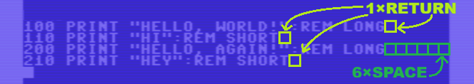
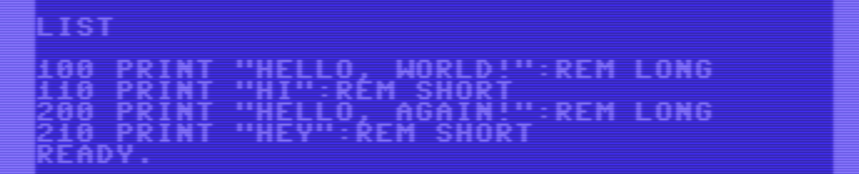
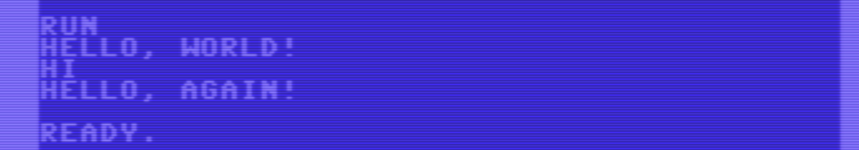
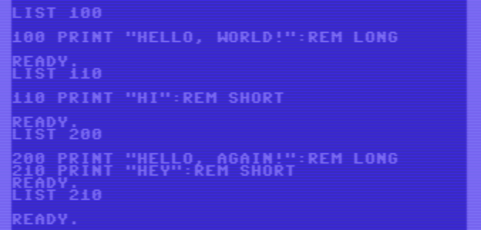
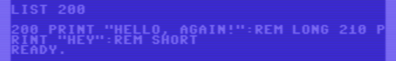
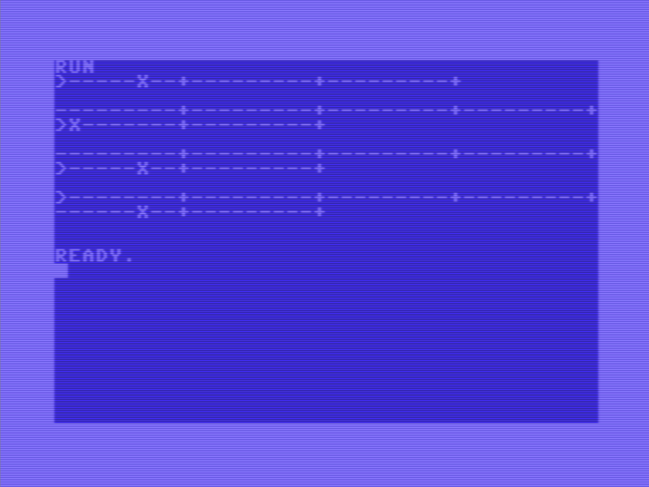
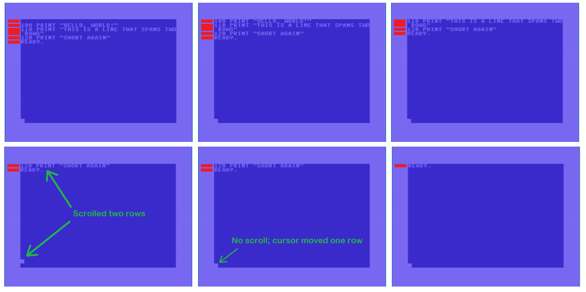
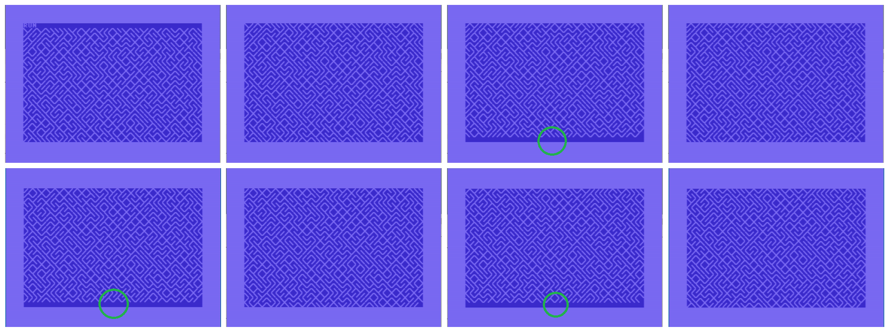
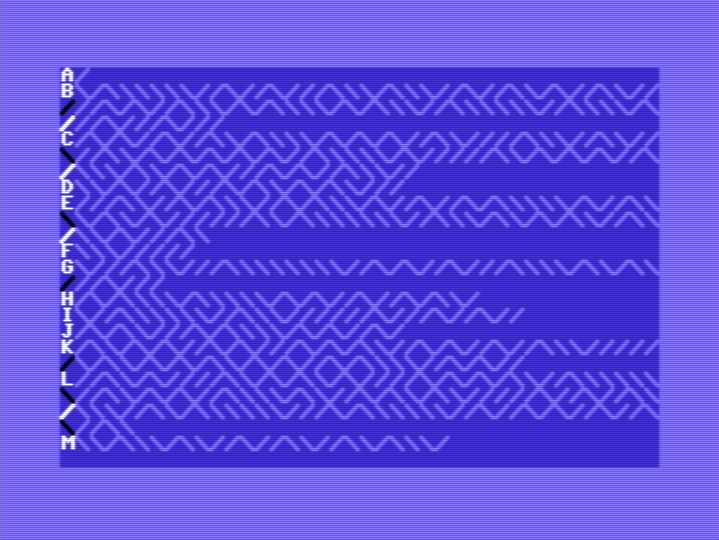

# Commodore 64 rows versus lines

Program lines in a Commodore 64 BASIC program can be up to 80 characters. 
Not more. A line longer than 40 characters is spread over two rows of the screen.
That two rows can form one line is not only a feature of BASIC, it is also 
a feature of the environment; or should I say of the C64 "terminal".

In this article we have a look at how C64 treats rows and lines.


## Hello program

We enter the following program, with one special step.
Lines 100 and 110 are terminated with an ENTER, 
but line 200 is extended with 6 spaces and then we 
continue entering line 210 which we terminate with an ENTER.

> This program is listed in lower case to make copy&paste to VICE easier.
> It is available as `HELLO` on the [disk](rowsvslines.d64).

```
100 print "hello, world!":rem long
110 print "hi":rem short
200 print "hello, again!":rem long
210 print "hey":rem short
```



When we `LIST` the program it looks "normal"; the same as how we entered it.



But when we `RUN` it, we miss the `HEY` from line 210.



When we `LIST` the individual lines, line 100 and 110 are fine.
But `LIST 200` also lists `210`, and `LIST 210` lists nothing.



What happens here is that line 210 is actually part of the `REM` comment of 
line 200, but the careful placement of 6 spaces hides that. When we edit line 
200 and delete 5 spaces, it is much more clear how the program really looks like.



You probably knew this.
And you probably found out there is no way to "split" line 200 in two lines.
In a modern editor an ENTER in the middle of a line splits at cursor.
But for the C64 terminal, ENTER is "commit" (the line or the command).

The only way to split is to `LIST` the line to be split, delete the part you don't want, 
prepend a fresh line number and pres ENTER. And then `LIST` the original line again and 
delete the part you just copied to the fresh line and pres ENTER again.

In other words **BASIC lines are terminated by ENTER, they may span two rows.**


## Tab

The hello program is contrived. In this section we have a look at the 
`tab()` function. It makes a distinction between rows and lines too.

Recall that the `tab(x)` function can only be used in the context of a `print` 
statement. It advances the cursor to column `x` of the current line 
(counting from 0). Unlike `spc(x)` which moves `x` positions from the current 
cursor position, `tab(x)` moves to an absolute position. However,
`tab(x)` does _not_ jump back. If the cursor is at position 30 and there is 
a `tab(25)`, the cursor stays at position 30.

The program `TAB` demonstrates `tab()`.

> This program is listed in lower case to make copy&paste to VICE easier.
> It is available as `TAB` on the [disk](rowsvslines.d64).

```basic
100 up$=chr$(145)
110 a10$="---------+"
120 a30$=a10$+a10$+a10$
130 a60$=a30$+a30$
140 :
200 print a30$
210 print up$;tab(6);"x"
220 print
230 :
300 print a60$
310 print up$;tab(6);"x"
320 print
330 :
400 print a60$
410 print up$;tab(46);"x"
420 print
430 :
500 print a60$
510 print up$;up$;tab(46);"x"
520 print
```

The program begins by defining a string `UP$` that moves the cursor one row up.
Next it defines a string of 10, 30 and 60 dashes.

This program then runs four tests. Each test it prints a line (of 30 or 60 characters), 
see lines 200, 300, 400, and 500. Note that the print does not end with a semicolon 
so the cursor moves to the next line. Then the test moves the cursor back up to the just 
printed line, jumps to a tab position and prints an `X` there, see lines 210, 310, 410, and 510.
A empty line (lines 220, 320, 420, and 520) separate a test from the next test.



The first test is as expected. We print a line of 30 characters, go up to the printed line, `tab(6)` and the
`X` is printed in column 6 (counting from 0).

The second test might come as a surprise. After printing 60 characters (2 screen rows), 
program line 310 moves the cursor up one _row_ up. This means the cursor is at position 40, and 
`tab(6)` would move the cursor back, so it is ignored. The cursor doesn't move and the `X` is printed at the start 
of the second row.

The third fragment tests this. Again 60 characters are printed, the cursor is moved 
one row up. Now program line 410 tabs to position 46, which is right of 40.
So the cursor moves to position 46 of the _two-row line_ and the `X` is printed.

The third fragment is a similar test. Here, after printing 60 characters, two rows, 
program line 510 moves _two rows_ up. So the cursor is in column 0 of the line.
a `tab(46)` moves to column 46, which is column 6 on the second row.

In other words **the terminal remembers which rows form one line.**


## Scrolling 

What I did notice in the past, but never fully realized, is that scrolling 
is impacted by lines spanning two rows.

The following program has two lines each fitting on one screen row (100, 120) 
and one line that spans two rows (110).

> This program is listed in lower case to make copy&paste to VICE easier.
> It is available as `SCROLL` on the [disk](rowsvslines.d64).

```basic
100 print "hello, world!"
110 print "this is a line that spans two rows"
120 print "short again"
```

The double row span is hard to see from the listing above, but easy to 
spot on the C64 screen (first screen shot). 

The series of screenshots starts with the cursor at the bottom of the screen.
Each screenshot we press ENTER once to go to the next screenshot.



Observe that each ENTER at the bottom scrolls _one_ row up, 
as long as the first row of the screen is a complete (one-row) line.

In screenshot 3, the top of the screen has a line that spans two 
screen rows, an ENTER now scrolls _two_ rows. Also notice that 
not only the top two rows scroll off the screen, but there is 
also an irregularity at the bottom: the cursor moved one row up!

In other words **scrolling is not per row but per line** (at the top of the screen).


## 10 PRINT

Recall the famous 10 PRINT program.

```basic
10 PRINT CHR$(205.5+RND(1));:GOTO 10
```

It  suffers from "scrolling is not per row but per line".
To show that, we have written an extended version that pauses 
each time the cursor reaches the bottom right corner of the screen.

> This program is listed in lower case to make copy&paste to VICE easier.
> It is available as `10PRINT` on the [disk](rowsvslines.d64).

```basic
100 i=rnd(-123)
110 for i=1 to 24*40-1
120 :print chr$(205.5+rnd(1));
130 next i
140 :
200 for t=0 to 9999:next t
210 :
300 for i=1 to 40
310 :print chr$(205.5+rnd(1));
320 next i
330 :
400 goto 200
```

We have made a series of screenshots - one at each scroll.



Note that every other scroll is _two_ rows instead of one 
(see the solid blue row at the bottom of the screen in 
shot 3, 5, and 7).

You might wonder why.
The 10 PRINT program prints character after character never 
ending the line: every `PRINT` ends with a semicolon (`;`).
So after 40 characters printed the first screen _row_ is full, but the _line_
continues. After 80 characters printed also the second screen _row_ is full,
and still the _line_ continues. 

However the C64 terminal can not handle lines longer than two rows.
So the line is aborted, and a new line is started on the third row.
That one continues till the fourth row, and again a new line is 
forced by the terminal. As a result the screen is filled with 
several lines of 80 characters, each occupying 2 rows.

As a result the scrolling of 10 PRINT is two rows, no rows, two rows, no rows, two rows ...

The "scrolling is not per row but per line" might sound reasonable.
The screen never starts with the second half of a line.
However, I think I could live with half lines at the top and 
have the smoother scrolling instead. 
I guess this is just an implementation choice; it probably made 
sense (easier terminal code?), and we have to live with it.


## Line link table

How does the terminal know that two rows form one line?
Enter the _line link table_, stored at addresses $00D9-$00F2.

For details of the line link table, see e.g. the famous book
[Mapping the 64](https://www.pagetable.com/c64ref/c64mem/#:~:text=Screen-,Line%20Link,-Table/Editor%20Temporary).
We will simplify it here.

The line link table has one byte per screen row.
Bit 7 at offset _r_ in the line link table is the link _flag_ for row _r_.
That flag is _set_ when that row contains the first half of a line (or an entire line).
That flag is _clear_ when that row contains the second half of a line.
The first row has its link flag at address $00D9 or 217, 
the second row at $00DA or 218, ..., the 25th at $00F1 or 241.
The entry at $00F2 or 242 is needed to easily implement scrolling.
Since the high nibble of a link like only contains the link flag 
and the other 3 bits are always 0, the high nibble is `8` for "first half or entire line"
and `0` for "second half".

The following program demonstrates the line link table.
The first half of the program (program lines 100-190) prints a screen full of lines.
Some output lines will be less than 40 characters (one row), some will be less 
than 80 (two rows) and some are even longer (3 rows) - maximum is 40×3½ characters. 

We use the characters from the 10 PRINT program to fill the lines.
Line 140 tags the _beginning of each line_ with an increasing 
letter (`A`, `B`, etc).

Line 110 seeds the random number generator so that each run produces 
the same output; delete it if you don't want that.

> This program is listed in lower case to make copy&paste to VICE easier, unfortunately, the 
> [petcat braced tokens](https://techtinkering.com/articles/tokenize-detokenize-commodore-basic-programs-using-petcat/#:~:text=Unprintable%20/%20Special%20Characters)
> such as `{home}` break that.
> The program is available as `LINELINKTABLE` on the [disk](rowsvslines.d64).

```basic
100 rem print lines with random length
110 c=rnd(-123)
120 for i=0 to 13
130 :print
140 :print chr$(65+i);
150 :for c=0 to rnd(1)*40*3.5
160 ::print chr$(205.5+rnd(1));
170 :next c
180 next i
190 :
200 rem show line link info for rows
210 d$="{home}{right}{right}{down}{down}{down}{down}{down}{down}{down}{down}{down}{down}{down}{down}{down}{down}{down}{down}{down}{down}{down}{down}{down}{down}{down}{down}{down}{down}"
220 for i=0 to 24
230 :l=peek(217+i):rem line link row r
240 :lh=int(l/16):ll=l and 15
250 :print left$(d$,i+3);"{rvon}";lh;ll;"rvoff";
260 next i:print "{home}"
270 get a$:if a$="" then 270
```

The interesting part is the second half of the program (program lines 200-270)
which runs once the screen is filled. It loops over all rows (`I` from 0 to 24)
and retrieves the line link table entry for that row: `L=PEEK(217+I)`.
Variable `LH` is the _high_ nibble of the line link, and 
variable `LL` is the _low_ nibble of the line link (see 240).

Line 210 constructs a constant string `D$`, used for positioning the cursor 
on column 2 of any row. Line 250 uses `D$` to print `LH` and `LL` 
(in reverse video) on row `I`.

Line 250 waits for a key press, ending the 
program, leading to `READY`, the `print"{home}"` on line 260 prevents a scroll.



The output is as expected.
Line `A` is short, two characters, it fits on one row; the row contains an 
_entire line_ so the high nibble of the line link is `8` to indicate that.
Line `B` is extra long, more than 2 rows. The first row is the the _first half of a line_
which results in the high nibble of the line link to be `8` again.
The next row is the _second half of a line_ of the `B` line: the high nibble is 
`0` to indicate that.
The next row is the third part of the `B` line. That third part did not fit on the 
first two rows, so the terminal started a new line (max line length is 80).
The third row is thus the the _first half of a line_ and
the high nibble is `8` again.

We ignored (and will continue doing that) the low nibble of the line link.
It denotes the memory page (high byte of an address) of the video memory 
where that row is stored. Video memory starts at $0400. This means the first row 
is stored in page $04, hence the low nibble of $00D9 is 4. 256 characters further
the page is 5.


## Better 10 PRINT

It is also possible to _write_ to the line link table.
We can _break_ long lines (two rows) into two unconnected parts.
One advantage is smoother scrolling.

Find below an improved version of the 10 PRINT program.
Every 40 characters printed, it splits row 1 from row 0 by 
setting the link flag of row 1. This results in smooth scrolling.

> This program is listed in lower case to make copy&paste to VICE easier.
> It is available as `10PRINTSMOOTH` on the [disk](rowsvslines.d64).

```basic
0 fori=1to40:printchr$(205.5+rnd(1));:next:poke218,128:goto
```

Note that if `GOTO` has no line number it jumps to line 0, a small optimization.

When you run this program it scrolls one row at a time.
Remove the POKE and it alternates between scrolling one and two rows.

The line link table contains other bits. A safer variant would be
`POKE 218,PEEK(218) OR 128` but this is slower, and the row is 
scrolled out soon anyhow...

## Links

- [D64image](rowsvslines.d64) of all BASIC programs in this article.
- Line link table in [Mapping the 64](https://www.pagetable.com/c64ref/c64mem/#:~:text=Screen-,Line%20Link,-Table/Editor%20Temporary).
- 10 PRINT [website](https://10print.org/).
- [petcat](https://techtinkering.com/articles/tokenize-detokenize-commodore-basic-programs-using-petcat/)
  utility (from VICE) that converts BASIC `.PRG` files to ASCII text files and back. 

(end)
